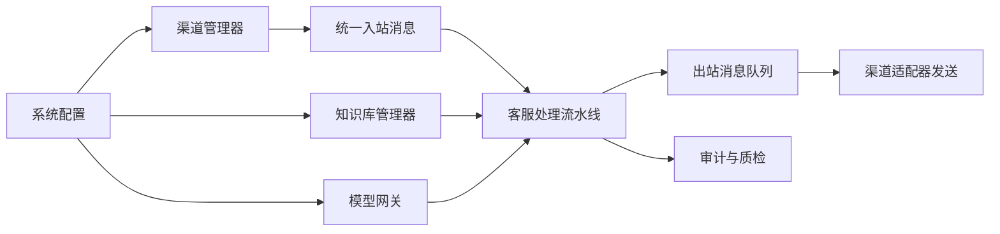
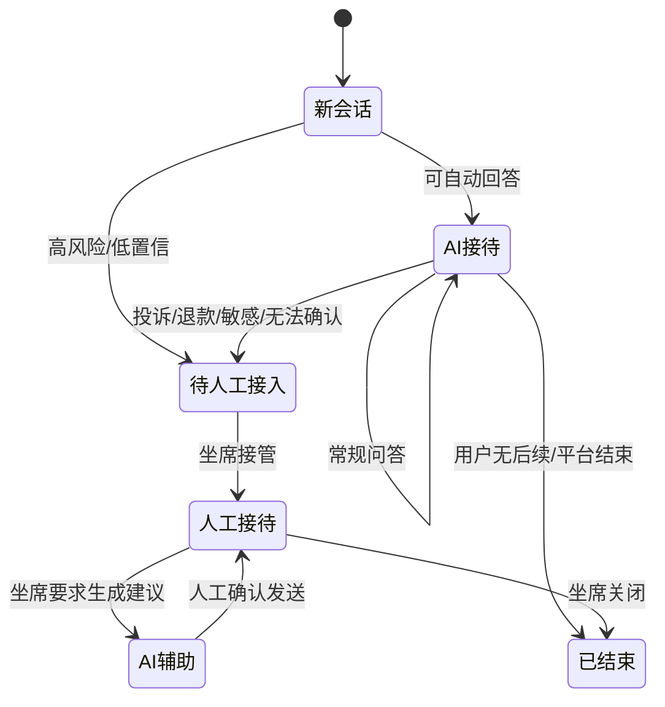
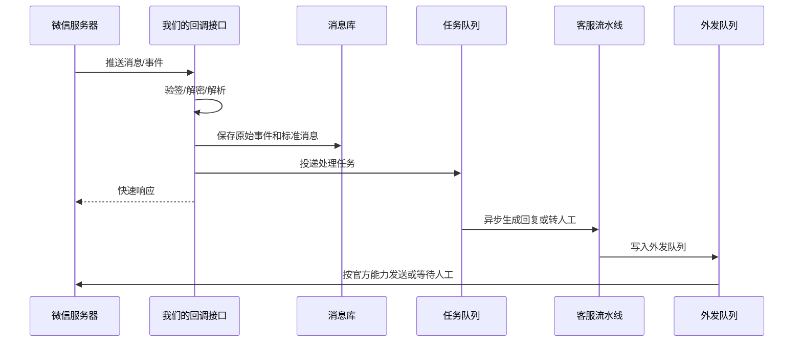
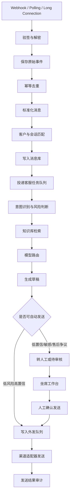

# AstrBot 多平台接入架构深度解读与自研客服中台重写路线

日期：2026-06-25  
适用项目：万法常世 AI 全智能客服系统，标准运营版  
结论级别：源码阅读 + 官方网页核验 + 工程推断  

## 0. 一句话结论

这里把用户口述的 “AsherBall” 先校准为本地已下载并解读过的 [AstrBot](https://github.com/AstrBotDevs/AstrBot)。AstrBot 对我们最有价值的不是“直接拿来交付”，而是它已经把多平台聊天机器人拆成了可学习的工程模块：平台管理器、适配器注册、统一消息对象、事件队列、流水线处理、模型提供方管理和后台运行状态。

但它不是一套可以直接卖给企业客户的商业客服中台。原因有三点：

1. 许可证是 AGPL-3.0-or-later，商业闭源二开不能直接复制代码、类结构、适配器实现或 UI。
2. AstrBot 的核心定位更偏通用机器人和个人/团队 IM Agent，不是以工单、坐席、SLA、审计、质检、客户资料、售后订单为核心的客服系统。
3. 电商平台的客服消息能力不是“有一个机器人框架就能接”，必须逐平台走官方开放平台、服务市场、服务商授权或企业认证，不能用个人号外挂、Hook、模拟点击、群控。

所以正确策略是：参考 AstrBot 的架构思想，采用 clean-room 方式重写为我们自己的“渠道接入层 + 客服会话中台 + 知识库 + 模型路由 + 坐席工作台”。

## 1. 本轮确认的资料来源

### 1.1 本地源码来源

本地仓库：

`/Users/ericlee/Desktop/Workspace/Project_022_开源爬虫与Agent框架研究/assets/reference-repos/AstrBot`

本地版本：

- tag：`v4.26.0`
- commit：`090f9008b63664da9feff123cc8db593f6cde3a9`
- license：`AGPL-3.0-or-later`

重点源码入口：

| 模块 | 本地文件 | 参考价值 |
| --- | --- | --- |
| 生命周期装配 | `astrbot/core/core_lifecycle.py` | 怎么把配置、数据库、模型、平台、知识库、插件、事件总线统一启动 |
| 平台管理器 | `astrbot/core/platform/manager.py` | 多平台适配器的加载、任务管理、状态和错误记录 |
| 平台基类 | `astrbot/core/platform/platform.py` | 每个渠道适配器应具备的运行、发送、回调、状态接口 |
| 适配器注册 | `astrbot/core/platform/register.py` | 用注册表和配置元数据驱动后台配置页 |
| 统一消息对象 | `astrbot/core/platform/astrbot_message.py` | 多平台消息归一化的最小字段集合 |
| 事件对象 | `astrbot/core/platform/astr_message_event.py` | 会话身份、发送、停止、trace、消息摘要的包装方式 |
| 事件总线 | `astrbot/core/pipeline/event_bus.py` | 入站消息进入队列后异步处理，而不是卡在回调请求里 |
| 流水线调度 | `astrbot/core/pipeline/scheduler.py` | 多阶段处理、终止、清理、流式输出的模式 |
| 企微适配器 | `astrbot/core/platform/sources/wecom/` | 企业微信、微信客服、客服状态机的强参考 |
| 公众号适配器 | `astrbot/core/platform/sources/weixin_official_account/` | 公众号回调、被动回复、超时处理的强参考 |
| 个人微信适配器 | `astrbot/core/platform/sources/weixin_oc/` | 只作为风险反例，不进入正式商用路线 |
| 模型提供方 | `astrbot/core/provider/` | 聊天、语音转文字、文字转语音、向量、重排应拆成不同能力 |

### 1.2 官方和公开网页来源

| 类别 | 来源 |
| --- | --- |
| AstrBot 项目页 | [AstrBot GitHub](https://github.com/AstrBotDevs/AstrBot) |
| 企业微信开发者中心 | [企业微信开发文档](https://developer.work.weixin.qq.com/document) |
| 企业微信接收消息事件 | [接收消息和事件](https://developer.work.weixin.qq.com/document/path/94670) |
| 微信服务号文档 | [微信服务号文档](https://developers.weixin.qq.com/doc/service/guide/) |
| 微信消息推送 | [微信推送消息](https://developers.weixin.qq.com/doc/service/guide/dev/push/) |
| 微信被动回复 | [被动回复用户消息](https://developers.weixin.qq.com/doc/service/guide/product/message/Passive_user_reply_message.html) |
| 微信客服能力 | [微信客服介绍](https://developers.weixin.qq.com/doc/service/guide/product/kf/intro.html) |
| 抖音开放平台 API 列表 | [OpenAPI 列表](https://developer.open-douyin.com/docs/resource/zh-CN/dop/develop/openapi/list/) |
| 抖音 Webhooks | [Webhooks 概述](https://developer.open-douyin.com/docs/resource/zh-CN/dop/develop/webhooks/summarize) |
| 抖店开放平台 | [抖店开放平台](https://op.jinritemai.com/) |
| 淘宝开放平台 | [淘宝开放平台](https://open.taobao.com/) |
| 拼多多开放平台 | [拼多多开放平台](https://open.pinduoduo.com/) |
| 京东开放平台 | [京东宙斯开放平台](https://jos.jd.com/) |
| 小红书开放平台 | [小红书开放平台](https://open.xiaohongshu.com/) |
| 电商智能客服研究参考 | [AliMe Assist](https://arxiv.org/abs/1801.05032)、[ICS-Assist](https://arxiv.org/abs/2008.13534) |

## 2. 许可证和 clean-room 边界

AstrBot 是 AGPL 项目。我们可以研究它公开展示的架构、运行方式、接口边界和设计思想，但不能把其代码复制进我们的商业闭源系统，也不应该照抄类名、函数名、配置结构、UI 布局或适配器实现。

建议边界如下：

| 可以学习 | 不能直接做 |
| --- | --- |
| 平台适配器注册思想 | 复制 `PlatformManager`、`register_platform_adapter` 等源码 |
| 统一消息模型思想 | 照搬 `AstrBotMessage` 字段和实现 |
| 事件队列和流水线思想 | 复制 pipeline stage 代码 |
| 企微/公众号接入流程理解 | 复制 AstrBot 的 wecom/weixin adapter 代码 |
| 模型能力拆分思想 | 复制 provider manager 实现 |
| WebUI 上的状态和配置思路 | 复制 UI、配置模板、图标、插件协议 |

工程上应采用“行为规格重写”：

1. 由本报告把 AstrBot 的行为抽象成我们自己的接口说明。
2. 新建我们自己的命名、数据表、接口、测试用例。
3. 代码实现时只看官方平台文档和本报告，不再逐行对照 AGPL 源码改写。
4. 在仓库记录“参考过 AstrBot 架构思想，未复制源码”的合规说明。

## 3. AstrBot 架构到底强在哪里

### 3.1 它的核心不是某个微信插件，而是运行时结构

AstrBot 启动时会统一装配配置、数据库、人物设定、模型、平台、会话、消息历史、知识库、定时任务、插件和事件总线。对我们来说，这提示了一个成熟客服系统不能把“调用大模型”写成一个孤立函数，而应该是：



我们应重写为：

- `ChannelManager`：管理所有渠道账号和适配器生命周期。
- `ConnectorRegistry`：注册企微、公众号、抖音、电商平台等连接器。
- `NormalizedMessage`：把不同平台消息变成统一结构。
- `ConversationWorkflow`：客服处理流水线。
- `ModelGateway`：按任务类型选择聊天、向量、重排、语音、图像模型。
- `Outbox`：所有外发消息先入库，再由渠道连接器发送和重试。

### 3.2 平台管理器值得完整学习

AstrBot 的平台管理器会读取配置中的平台列表，然后按平台类型加载不同适配器。它支持平台实例、任务、状态和错误记录。这个模式对我们非常重要，因为客服中台会接多个企业、多个渠道、多个账号。

我们需要重写的目标结构：

```text
ChannelManager
  - load_enabled_accounts()
  - create_connector(account_config)
  - start_connector(account_id)
  - stop_connector(account_id)
  - reload_connector(account_id)
  - get_connector_status(account_id)
  - record_error(account_id, error)
  - expose_webhook(account_id, webhook_uuid)
```

客服系统里不能只有“一个微信机器人”。真正的中台至少要支持：

- 一个租户多个渠道。
- 一个渠道多个账号。
- 一个账号多个回调密钥版本。
- 每个连接器有健康状态、失败次数、最近回调时间、最近发送时间。
- 每条消息有外部消息 ID、内部消息 ID、幂等键和发送结果。

### 3.3 适配器注册机制适合改造成后台配置表单

AstrBot 的注册装饰器会给每个适配器挂上描述、默认配置、展示名、logo、配置元数据等。我们不能复制这套实现，但应该吸收它的产品思想：渠道连接器必须是“配置驱动”的。

我们自己的连接器元数据应包括：

| 字段 | 说明 |
| --- | --- |
| `connector_type` | `wecom_kf`、`wechat_official_account`、`douyin_open`、`taobao_service_market` 等 |
| `display_name` | 后台展示名称 |
| `auth_mode` | 回调签名、OAuth、服务商授权、应用密钥等 |
| `inbound_modes` | webhook、polling、long connection、manual import |
| `outbound_modes` | passive reply、active send、service-message、human-assist-only |
| `message_types` | text、image、voice、video、file、order_event、refund_event |
| `rate_limits` | 平台限制和我们自己的限流 |
| `requires_approval` | 是否要求人工批准才能发送 |
| `risk_level` | 官方、半开放、仅辅助、禁止商用 |

## 4. 微信和企业微信怎么接才真实可靠

### 4.1 企业微信和微信客服是第一优先级

AstrBot 的 `wecom` 适配器对我们很有参考价值。它做了几件关键事情：

- 使用企业微信回调进行 URL 验证和消息解密。
- 对企业应用消息、图片、语音、文件等做统一转换。
- 对微信客服事件 `kf_msg_or_event` 触发后，再调用同步消息接口拉取具体消息。
- 对微信客服会话状态进行理解，例如未处理、智能助手接待、待接入池、人工接待、已结束。
- 在微信客服模式下避免不支持的主动发送。

这给我们的工程结论是：企业微信/微信客服应作为第一条正式生产渠道，不使用个人微信号，不做外挂。

推荐状态机：



我们应建设的字段：

| 字段 | 说明 |
| --- | --- |
| `external_userid` | 企业微信外部联系人或微信客服用户身份 |
| `open_kfid` | 微信客服账号身份 |
| `service_state` | 平台侧接待状态 |
| `internal_state` | 我们侧会话状态：AI、待人工、人工、关闭 |
| `last_sync_cursor` | 拉取消息游标 |
| `last_external_msg_id` | 外部最后消息 ID |
| `can_active_send` | 当前状态是否允许主动外发 |

### 4.2 公众号/服务号不能让模型慢慢想

AstrBot 的公众号适配器专门处理了一个重要约束：微信服务器要求开发者服务器在短时间内响应，否则会出现重试。源码里把等待时间压到约 4 秒，并通过缓存和被动回复模式处理。

我们的工程结论：

1. 公众号回调不能同步等待大模型完整生成。
2. 必须快速验签、落库、去重、返回平台允许的响应。
3. 复杂回答走异步任务和客服消息能力，但必须满足微信官方规则。
4. 需要处理平台重试，不能重复生成和重复发送。

推荐流程：



### 4.3 个人微信适配器必须排除在正式交付之外

AstrBot 中有 `weixin_oc` 个人微信适配器，会涉及扫码登录、轮询、个人号消息收发等能力。这类能力对技术研究有参考意义，但不应进入我们的商用交付。

正式规则：

- 不使用个人微信 Hook。
- 不使用模拟点击。
- 不使用群控。
- 不使用非官方协议做客户消息自动化。
- 不把“个人号自动回复”写进报价或交付承诺。

可替代路线：

| 需求 | 合规替代 |
| --- | --- |
| 私域客户咨询 | 企业微信客户联系、微信客服、公众号服务号、小程序客服 |
| 门店/销售微信承接 | 企业微信外部联系人 + 微信客服 |
| 社群运营 | 企业微信群机器人只做通知或人工辅助，不承诺个人号自动回复 |
| 私聊自动问答 | 企业微信官方能力或公众号客服消息能力 |

## 5. 抖音、小红书、淘宝、拼多多、京东的真实边界

### 5.1 抖音开放平台有明确 webhook 和部分私信/经营能力

抖音开放平台文档已经公开说明：

- Webhook 用于用户事件反向通知。
- 配置回调地址时会发送校验请求，需要立即返回 challenge。
- 如果服务器长期不响应，事件订阅可能被取消。
- 连接超过 5 秒会断开，并会重试。
- 可以通过请求头 `Msg-Id` 去重。
- 可以通过 `X-Douyin-Signature` 结合 client secret 校验消息来源。
- OpenAPI 列表中有私信群聊、服务市场、生活服务、订单、退款、商品、库存等能力分类。

我们的结论：

抖音可以作为第二阶段重点渠道，但要拆成两个路线：

| 路线 | 能力 | 适用 |
| --- | --- | --- |
| 抖音开放平台 | Webhook、私信群聊相关能力、留资卡片、服务市场能力 | 内容号、线索留资、生活服务 |
| 抖店开放平台 | 商品、订单、售后、服务市场授权 | 电商商家、抖店经营 |

不能提前承诺“所有抖音/抖店消息都能自动回复”。必须先确认客户账号类型、应用权限、类目、服务商身份和平台审核结果。

### 5.2 淘宝、拼多多、京东不能笼统承诺自动接管客服聊天

本轮核验到淘宝开放平台、拼多多开放平台、京东宙斯开放平台都有官方平台入口，但公开页面本身不足以确认“通用客服聊天消息可由第三方系统自动收发”。电商平台的买家咨询通常和平台自有客服工具、服务市场、服务商权限、店铺授权强绑定。

因此报价和工程文档应改成更真实的表达：

| 平台 | 可以先承诺 | 不应直接承诺 |
| --- | --- | --- |
| 淘宝/天猫 | 店铺授权核验、商品/订单/售后数据接入、知识库同步、客服辅助回复、服务市场方案评估 | 未经权限确认的千牛/旺旺自动代发 |
| 拼多多 | 开放平台授权核验、订单/售后/商品数据接入、辅助回复、服务市场方案评估 | 未经权限确认的自动接管买家聊天 |
| 京东 | JOS 授权核验、商品/交易/售后数据接入、客服辅助回复 | 未经权限确认的咚咚聊天自动发送 |
| 小红书 | 开放平台/专业号/服务商能力核验、评论/私信/线索场景评估 | 未经权限确认的全自动私信回复 |

更稳的产品包装是：

1. 已获官方消息权限的平台，开放“AI 自动接待 + 人工接管”。
2. 未获官方消息权限的平台，只开放“AI 辅助回复 + 人工复制发送 + 知识库推荐 + 质检复盘”。
3. 电商平台先把订单、物流、退款、商品、库存、活动规则接入知识库和坐席工作台，降低人工查询成本。
4. 等客户具备服务商授权或平台消息能力，再升级为自动回写。

### 5.3 电商客服真正强的地方不是“聊天口子”，而是业务上下文

参考 AliMe Assist 和 ICS-Assist 这类电商智能客服研究，成熟电商客服系统的重点通常是：

- 识别意图：售前咨询、尺码、发货、物流、退款、发票、活动、投诉。
- 召回知识：商品参数、活动规则、库存、订单状态、售后政策。
- 结合上下文：当前订单、用户身份、店铺规则、平台规则。
- 给出候选处理方案：自动回复、转人工、创建工单、升级主管。
- 人工辅助：坐席看到建议、证据、来源和风险提示。

这说明我们不能只做一个“FAQ + 大模型聊天框”。真正的中台要能接业务数据。

## 6. 我们应该重写出的渠道接入层

### 6.1 连接器接口

建议新建我们自己的连接器接口：

```text
ChannelConnector
  - verify_webhook(request) -> VerificationResult
  - parse_raw_event(request) -> RawInboundEvent
  - normalize_inbound(raw_event) -> NormalizedInboundMessage[]
  - send_outbound(outbound_message) -> DeliveryResult
  - sync_messages(cursor) -> SyncResult
  - get_capabilities() -> ChannelCapabilities
  - health_check() -> ChannelHealth
  - rotate_credentials(secret_version) -> RotationResult
```

这个接口要表达两件事：

1. 入站和出站分离。入站 webhook 不等于能主动出站。
2. 每个平台能力不同。公众号有被动回复限制，企业微信客服有状态机，抖音有 webhook 重试和签名，电商平台可能只有数据接口没有聊天外发。

### 6.2 标准入站消息模型

建议标准字段：

| 字段 | 说明 |
| --- | --- |
| `tenant_id` | 租户 |
| `channel_type` | 渠道类型 |
| `channel_account_id` | 渠道账号 |
| `external_conversation_id` | 平台侧会话 ID |
| `external_message_id` | 平台侧消息 ID |
| `sender_external_id` | 平台侧用户 ID |
| `sender_display_name` | 昵称或展示名 |
| `message_type` | text、image、audio、video、file、order_event、refund_event、system_event |
| `text` | 文本内容 |
| `attachments` | 附件元数据 |
| `raw_payload_ref` | 原始事件存储引用 |
| `received_at` | 接收时间 |
| `signature_status` | 验签结果 |
| `dedupe_key` | 去重键 |

### 6.3 标准出站消息模型

| 字段 | 说明 |
| --- | --- |
| `message_id` | 内部消息 ID |
| `conversation_id` | 内部会话 |
| `channel_account_id` | 渠道账号 |
| `content` | 回复文本或结构化卡片 |
| `attachments` | 图片、语音、文件 |
| `idempotency_key` | 幂等发送键 |
| `approval_status` | 自动通过、待人工审核、已拒绝 |
| `risk_level` | 低、中、高 |
| `send_after` | 计划发送时间 |
| `delivery_status` | pending、sending、sent、failed、blocked |
| `external_response` | 平台返回结果 |

### 6.4 必要数据表

| 表 | 作用 |
| --- | --- |
| `channel_connectors` | 连接器类型定义 |
| `channel_accounts` | 每个租户绑定的渠道账号 |
| `channel_webhook_secrets` | 回调密钥、token、aes key、版本 |
| `inbound_raw_events` | 原始回调事件，不做覆盖 |
| `inbound_messages` | 标准化入站消息 |
| `outbound_messages` | 外发消息 outbox |
| `outbound_delivery_attempts` | 发送尝试、错误、重试 |
| `channel_capabilities` | 当前账号已确认的平台能力 |
| `conversation_channel_identities` | 外部用户和内部会话映射 |
| `channel_rate_limits` | 渠道限流和平台限制 |
| `channel_health_checks` | 连接器健康检查 |
| `channel_audit_events` | 配置、密钥、发送、接管审计 |

### 6.5 处理流水线



## 7. 模型路由怎么借鉴 AstrBot

AstrBot 的 provider 层把模型能力拆成了聊天、语音转文字、文字转语音、向量、重排等类型。这个思路非常正确。客服系统不应该说“接一个 Omni 模型全部解决”，而应该把任务拆开：

| 任务 | 推荐模型能力 | 是否必须大模型 |
| --- | --- | --- |
| 精准 FAQ 命中 | BM25/向量/规则 | 不一定 |
| 知识库检索 | 向量模型 + 关键词检索 | 需要 embedding，不需要聊天模型 |
| 检索结果排序 | rerank | 可选但推荐 |
| 常规客服回复 | 聊天模型 | 需要 |
| 图片问题理解 | 视觉模型/OCR | 仅图片场景需要 |
| 语音消息理解 | 语音转文字 | 仅语音场景需要 |
| 高风险判断 | 分类模型/规则/大模型复核 | 组合 |
| 坐席辅助摘要 | 聊天模型 | 需要 |

建议路由：

```text
高置信 FAQ 命中
  -> 不调聊天大模型，直接返回审核过答案

普通知识库问题
  -> BM25 + 向量召回 -> rerank -> 百炼/千问生成

复杂售后/投诉/价格/承诺问题
  -> 生成草稿，但进入人工审核

图像/截图问题
  -> OCR/视觉模型提取事实 -> 再进入知识库和回复模型

语音问题
  -> STT 转写 -> 再进入文本流程

低置信或越权问题
  -> 不自动回答，转人工
```

模型网关应支持：

- 默认模型。
- 备用模型。
- 按租户覆盖。
- 按渠道覆盖。
- 按任务类型覆盖。
- 失败 fallback。
- 成本统计。
- 延迟统计。
- 输出审计。

## 8. 中控台应该看什么

中控台不是给老板“看每一句机器人表演”的页面，而是客服运营和风险控制中心。

核心页面应是：

| 页面 | 要解决的问题 |
| --- | --- |
| 渠道状态 | 哪些渠道接通，回调是否正常，发送是否失败 |
| 会话收件箱 | 当前有哪些客户正在等回复，谁在接待，AI 是否接管 |
| 低置信复盘 | AI 哪些问题答不上来，哪些应补知识库 |
| 待人工审核 | 哪些回复必须人工确认后才能发送 |
| 客户资料 | 这个人是谁，来自哪个平台，有哪些订单/历史问题 |
| 知识库 | 哪些知识正在被用，哪些过期，哪些需要审核 |
| 坐席工作台 | 人工接管、改写 AI 草稿、发送、打标签、建工单 |
| 质检审计 | 哪些回复命中敏感规则，谁改过配置，谁发送过承诺 |
| 成本监控 | 每个租户、渠道、模型的调用成本和失败率 |

这和 AstrBot 的 WebUI 状态页不同。AstrBot 更偏机器人配置和插件运行状态，我们要转化成“客服运营中台”。

## 9. 三阶段渠道落地路线

### 9.1 A 档：私域官方渠道先跑通

目标：官网小窗 + 企业微信/微信客服 + 公众号/服务号。

周期估计：2 到 4 周。

工程范围：

- `ChannelConnector` 抽象。
- Webhook 验签和原始事件表。
- 企微/微信客服连接器。
- 公众号连接器。
- 出站 outbox。
- 会话收件箱。
- 人工接管。
- 知识库 FAQ/结构化知识卡片。
- 模型路由最小版。

适合客户：

- 官网咨询。
- 私域留资。
- 门店/教育/服务业。
- 还不追求复杂电商平台自动化的客户。

主要风险：

- 公众号被动回复时限。
- 企业微信客服状态机。
- 客户没有认证主体或权限配置不完整。

### 9.2 B 档：私域 + 抖音/小红书线索场景 + 电商辅助

目标：在 A 档基础上，把抖音开放平台/抖店、小红书开放平台、电商数据接入做成可销售能力。

周期估计：4 到 8 周，取决于平台审核和客户账号权限。

工程范围：

- 抖音 webhook 验签、challenge、Msg-Id 去重。
- 抖音线索/私信相关能力核验和接入。
- 抖店商品/订单/售后数据同步评估。
- 淘宝、拼多多、京东开放平台授权核验。
- 电商订单、物流、退款、商品、活动数据进入知识库。
- 坐席侧 AI 回复建议。
- 平台未开放自动发送时，标记为人工辅助，不自动外发。

适合客户：

- 抖音获客。
- 小红书线索。
- 多平台经营但暂时只要求提效，不强求全自动回复。
- 电商商家需要客服辅助和售后查询。

主要风险：

- 平台权限审核周期不可控。
- 不同店铺类目能力差异很大。
- 自动回写消息权限不能提前打包承诺。

### 9.3 C 档：全渠道企业增强版

目标：多租户、多渠道、多坐席、工单、SLA、审计、质检、知识库闭环、企业级部署。

周期估计：8 到 16 周以上。

工程范围：

- 多租户隔离。
- RBAC 权限。
- 全渠道连接器注册和健康监控。
- 工单系统。
- SLA 和排班。
- 质检规则。
- 复杂文档 RAG。
- 订单/售后/库存/CRM 深度集成。
- 模型成本治理。
- 私有化部署或专属云。

适合客户：

- 中大型企业。
- 多店铺、多坐席、多品牌。
- 有审计、合规、绩效和质检要求。

主要风险：

- 集成范围大，必须按平台和业务线分阶段验收。
- 本地模型和私有化会显著增加部署、运维和硬件成本。
- 平台接口、服务市场和授权政策随时可能变化，必须持续核验。

## 10. 对现有标准运营版的直接施工建议

当前 `standard_ops` 已经有 FastAPI、React、PostgreSQL、Redis、租户、账号、角色、团队、渠道、联系人、会话、消息、审计的基础骨架。下一步不要急着接所有平台，应先把渠道层打稳。

建议施工顺序：

1. 建立 `backend/app/channels/`。
2. 定义我们自己的 `ChannelConnector` 抽象和 `ChannelCapabilities`。
3. 新增渠道相关数据表迁移：账号密钥、原始事件、外发队列、发送尝试、健康检查。
4. 先做 `mock_webhook` 连接器，用本地测试模拟所有平台回调。
5. 再做 `wecom_kf` 连接器骨架，只实现验签、落库、标准化、outbox，不急着真发。
6. 接会话收件箱，让前端能看见入站消息、AI 草稿、待审核、人工接管状态。
7. 做 `wechat_official_account` 连接器，重点验证快速 ACK、去重、异步处理。
8. 做抖音连接器前先完成应用权限和回调域名核验。
9. 电商平台先做“平台能力核验表 + 授权状态 + 数据同步”，不要先写自动发送。

最小可验收目标：

- 任意渠道回调都能保存原始事件。
- 重复回调不会重复生成回复。
- 前端能看到渠道状态和会话。
- 出站消息必须经过 outbox。
- 高风险回复进入人工审核。
- 每次发送都有审计记录。

## 11. 需要从 AstrBot 学，但要改得更适合客服的点

| AstrBot 做法 | 我们的客服化改造 |
| --- | --- |
| 多平台适配器 | 多租户渠道连接器 |
| 机器人消息事件 | 客户会话消息事件 |
| 插件优先处理 | 客服业务规则优先处理 |
| 唤醒词/at 触发 | 客户来咨询即触发，不需要唤醒词 |
| 平台消息链 | 文本、附件、订单、退款、系统事件统一消息 |
| provider manager | 模型网关 + 成本治理 + fallback |
| pipeline stage | 去重、检索、意图、风险、草稿、审核、外发 |
| WebUI 状态 | 运营中控台、坐席工作台、质检审计 |
| 个人微信适配 | 禁止正式商用，只保留风险说明 |

## 12. 哪些能力现在不要做

为了避免把系统带偏，以下能力不建议进入第一阶段：

- 个人微信自动回复。
- 全平台一口气都接。
- 插件市场。
- 允许客户上传任意代码插件。
- 自动安装第三方依赖。
- 未经审核的自动退款、自动承诺赔付。
- 低置信答案自动发送。
- 把电商平台未确认权限的聊天发送写进报价承诺。

## 13. 最终判断

AstrBot 值得深度参考，而且尤其适合指导我们做“多渠道接入层”的工程设计。但它不是我们的产品底座，也不是电商客服的完整答案。

我们应该学它的五个核心思想：

1. 多平台适配器要统一注册和管理。
2. 外部消息必须标准化成内部消息对象。
3. 回调请求不能同步跑完模型，要进入事件队列和流水线。
4. 模型能力要按聊天、向量、重排、语音、图像拆开管理。
5. 后台必须展示连接器状态、错误、配置和运行数据。

我们必须新增客服系统自己的五个核心能力：

1. 多租户和坐席权限。
2. 客户、会话、工单、SLA、审计。
3. 知识库检索和低置信复盘。
4. 人工接管与发送审批。
5. 电商业务上下文，尤其是订单、物流、售后、商品、活动规则。

最推荐下一阶段路线：

先按 A 档完成“官方私域渠道 + 渠道连接器基础设施 + 会话收件箱 + outbox + 人工接管”。然后再进入 B 档，把抖音和电商平台做成“授权核验 + 数据接入 + 回复辅助 + 可用时自动外发”的组合能力。

这条路线最稳，因为它既能尽快做出可演示、可售卖的系统，又不会因为平台权限、封号风险或 AGPL 许可证问题把商业交付埋雷。

