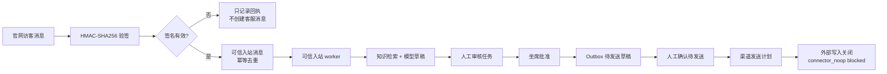

# P3-04 单渠道 Copilot Sandbox 闭环

## Engineering Control Card

- Stage: P3-04 单渠道 Copilot sandbox。
- 当前主线阶段: 从坐席工作台产品化进入“单渠道受控入站到人工确认”的真实链路验证。
- 上一阶段真正完成: P3-03 已完成坐席工作台主屏、七类队列、会话证据详情、outbox、失败复盘、渠道健康概览和桌面/移动构建验证。
- 上一阶段明确没有完成: 没有真实平台外发；没有真实企业微信、公众号、抖音、小红书、淘宝、京东、拼多多接入；没有生产级队列；没有客户真实 50-100 题人工事实性验收。
- 本轮要交付的客户可见价值: 用官网客服沙盒跑通“可信入站 -> AI 建议 -> 人工审核 -> 待发送草稿 -> 渠道发送计划被门禁拦截”的 Copilot 闭环，让客户和坐席能理解系统如何处理一个真实入口的问题。
- 本轮是否只是评测: 否。本轮是产品闭环和渠道闭环，不新增离线 benchmark。
- 如果是评测，本轮问题是什么: 不适用。
- 如果是评测，停止条件是什么: 不适用。
- 本轮不做什么: 不接个人微信外挂、Hook、群控、模拟点击、商家后台 RPA；不打开真实外部自动发送；不写真实客户生产数据；不把官网 fixture 冒充全平台接通。
- 外部风险: 官网沙盒没有真实平台封号风险；真实企业微信、公众号、电商平台接入仍需要官方账号、授权、回调域名、密钥管理和平台规则复核。
- 需要用户授权的动作: 打开真实外发、接入真实平台账号、使用真实客户数据或付费模型批量调用前都需要单独确认。
- 验证方式: 后端端到端测试、前端构建、关键文案检索、项目文档写回。
- 写回文件: 本文档、P3 总计划、Project_012 执行记录、关键决策、文件索引、复盘与采坑。
- 下一阶段: P3-05 试点部署包；或在取得官方账号/公网回调/密钥后进入单平台真实 sandbox。

## 全量进度感知

- 最新已完成阶段: P3-03 坐席工作台产品化 v1。
- 当前正在推进阶段: P3-04 单渠道 Copilot sandbox。
- 这不是哪些能力: 不是全平台客服；不是微信个人号代发；不是真实企业微信/公众号/电商平台外发；不是生产高并发 worker。
- 已经真实可验证的能力: 官网 HMAC fixture 验签、无效签名阻断、可信消息创建、幂等去重、AI 草稿进入人工审核、审核通过生成 outbox、发送计划保持外部写入关闭、审计记录可查。
- 仍是 rehearsal / fixture / dry-run / placeholder 的能力: 密钥来自开发 fixture；重放 nonce 没有生产级持久化；发送计划是 `connector_noop`；队列不是生产 Redis/Celery/RQ；回执 reconciliation 仍是占位。
- 本轮新增客户可见价值: 前台增加官网 Copilot 沙盒卡片，明确展示单渠道闭环、外发门禁、沙盒验收状态和下一步操作。
- 本轮是否需要评测: 只需要端到端 smoke，不新增评测系统。
- 本轮评测回答什么唯一问题: 官网沙盒能否安全跑完 Copilot 闭环并证明不会误外发。
- 评测停止条件: 验收测试覆盖 P3-04 六项 acceptance 后停止，不继续扩大题库或模型 benchmark。
- 本轮结束后下一阶段: P3-05 部署试点包，或接入一个真实官方测试号继续单渠道 sandbox。

## 本轮选择

本轮选择 `website sandbox`，原因是它是自有入口，不依赖真实微信、电商或内容平台账号，也不会触发个人号外挂、Hook、群控、模拟点击等封号路径。

允许路径:

| 路径 | 本轮状态 | 说明 |
| --- | --- | --- |
| 官网客服沙盒 | 已选 | 自有入口，适合验证中台、验签、可信入站、人工审核和 outbox。 |
| 企业微信官方测试号 | 待后续 | 需要真实企业微信后台、回调域名、Token、EncodingAESKey、事件解密和官方接口授权。 |
| 微信公众号客服沙盒 | 待后续 | 需要公众号后台配置、服务器验证、安全模式和客服消息窗口规则。 |

禁止路径:

| 路径 | 结论 |
| --- | --- |
| 个人微信外挂 | 不进入正式方案。 |
| Hook / 注入 / 抓包代发 | 不进入正式方案。 |
| 群控 / 模拟点击 | 不进入正式方案。 |
| 商家后台 RPA 代发 | 不作为正式交付链路。 |

## Copilot 闭环



关键判断:

- 无效签名只进入回执和审计，不创建消息、不触发 worker。
- 有效签名且带有 `message_id`、`visitor_id`、`text` 时才创建可信入站消息。
- 重放相同 `provider_event_id` 或 `external_message_id` 时不重复建消息。
- AI 只生成建议草稿，风险级别为 `medium` 时必须进入人工审核。
- outbox 草稿必须人工确认后才进入 `ready_to_send`。
- 渠道发送计划保持 `connector_noop`，状态为 `blocked`，不会真实外发。

## 后端验收

新增验收测试:

```text
backend/tests/test_p3_04_website_copilot_sandbox.py
```

覆盖项:

| 验收项 | 覆盖方式 |
| --- | --- |
| invalid signature does not create message | 错签官网 webhook 返回 `signature_invalid`，会话列表为空。 |
| valid inbound creates message once | 正确 HMAC 入站创建一条可信消息。 |
| replay does not duplicate message | 同一请求重放返回 `duplicate_ignored`，会话消息仍只有一条。 |
| AI suggestion enters review | trusted inbound worker 生成 `human_review` 任务，证据含 deterministic model gateway 和知识命中。 |
| human approval creates outbox draft | PATCH 人工审核为 `approved` 后创建 pending outbox 草稿。 |
| send remains gated | 草稿确认后生成 `connector_noop` 发送计划，状态 `blocked`，`external_write=false`。 |
| receipt is auditable | 三条回执可查，签名值不落库，审计链包含 webhook、worker、outbox、send plan。 |

建议命令:

```bash
cd /Users/ericlee/Desktop/肥肥lu/lite_a_customer_service/standard_ops/backend
.venv/bin/python -m pytest tests/test_p3_04_website_copilot_sandbox.py -q
```

回归命令:

```bash
cd /Users/ericlee/Desktop/肥肥lu/lite_a_customer_service/standard_ops/backend
.venv/bin/python -m pytest tests/test_channel_webhooks_api.py tests/test_trusted_inbound_worker_api.py tests/test_outbox_api.py tests/test_channel_connectors_api.py tests/test_p3_04_website_copilot_sandbox.py -q
```

前端命令:

```bash
cd /Users/ericlee/Desktop/肥肥lu/lite_a_customer_service/standard_ops/frontend
npm run build
```

## 前端可见状态

P3-04 前端入口应展示以下状态，而不是只给工程按钮:

| 模块 | 展示内容 |
| --- | --- |
| 单渠道 | 官网客服沙盒。 |
| 入站边界 | HMAC 验签、签名值不落库、错签不建消息。 |
| Copilot 状态 | AI 建议只进入人工审核，不自动回复。 |
| Outbox 状态 | 草稿需人工确认，发送计划为 `connector_noop`。 |
| 外发门禁 | 真实外发关闭，未获授权前不触达外部平台。 |
| 下一步 | 接真实测试号前，需要官方账号、回调域名、密钥、平台规则确认。 |

## 仍不能承诺

- 不能承诺已接通企业微信、公众号、抖音、小红书、淘宝、京东、拼多多。
- 不能承诺真实外发和真实回执 reconciliation 已完成。
- 不能承诺生产级高并发队列、熔断、死信、重试已经完成。
- 不能承诺密钥已进入 KMS/Secrets Manager。
- 不能承诺客户真实知识包和真实 50-100 题验收已经完成。

## 下一步施工

1. P3-05 试点部署包: 环境变量、PostgreSQL 迁移、备份恢复、日志审计、启动脚本、回滚清单。
2. 单平台真实 sandbox: 优先企业微信官方测试号或微信公众号测试号，准备公网回调、Token、EncodingAESKey/AppSecret、事件解密和官方 send API 的沙盒发送策略。
3. 客户真实资料验收: 导入客户真实脱敏知识包和 50-100 条真实问题，做人工事实性标签。

## Stage Completion

- Stage: P3-04 单渠道 Copilot sandbox。
- What changed: 新增官网沙盒端到端验收测试；更新官网 provider registry 为“fixture 已验证可信消息创建，生产仍未完成”；新增本阶段说明文档；前端新增官网 Copilot 沙盒入口。
- What was verified: `tests/test_p3_04_website_copilot_sandbox.py -q` 通过；相关后端回归 `tests/test_channel_webhooks_api.py tests/test_trusted_inbound_worker_api.py tests/test_outbox_api.py tests/test_channel_connectors_api.py tests/test_p3_04_website_copilot_sandbox.py -q` 通过，共 `27 passed`；`npm run build` 通过；Chrome CDP 桌面 1440x1000 截图显示 `innerWidth=1440`、`scrollWidth=1440`、沙盒面板存在；移动 390x1200 截图显示 `innerWidth=390`、`scrollWidth=390`、沙盒面板宽度 346px，无横向溢出。
- What remains not done: 真实官方平台接入、真实外发、生产密钥、生产队列、高并发、客户真实题库和 P3-05 部署包仍未完成。
- Whether this was customer-visible: 是。前端能看到单渠道 Copilot 沙盒闭环和外发门禁。
- Whether this was only evaluation: 否。本轮是渠道和产品闭环。
- Next stage: P3-05 试点部署包，或在拿到官方账号后继续单平台真实 sandbox。

验证截图:

- `/Users/ericlee/Desktop/肥肥lu/lite_a_customer_service/standard_ops/output/p3_04_website_sandbox_desktop.png`
- `/Users/ericlee/Desktop/肥肥lu/lite_a_customer_service/standard_ops/output/p3_04_website_sandbox_mobile.png`
