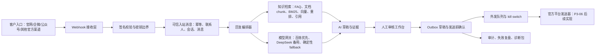
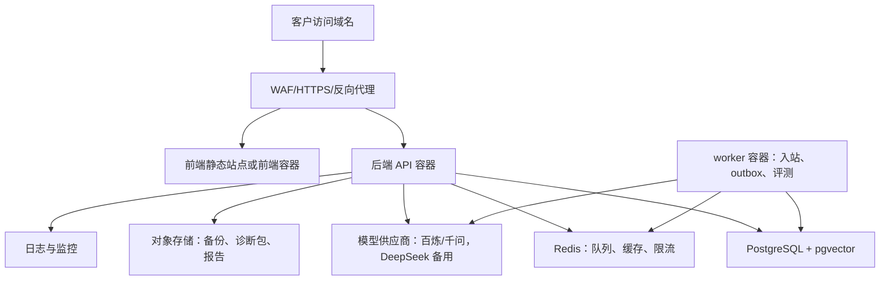

# P3-05B 托管云端版与私有化运维落地计划

> **For agentic workers:** REQUIRED SUB-SKILL: Use `superpowers:subagent-driven-development` or `superpowers:executing-plans` to implement this plan task-by-task. Steps use checkbox (`- [ ]`) syntax for tracking.

**Goal:** 把 P3-05A 已完成的部署准备，继续推进成 Lite 试点版封版、托管云端版落地路径、私有化部署运维 SOP，以及标准运营版 P3-06 的施工入口。

**Architecture:** 当前阶段采用“自研客服中台 + 容器化交付 + PostgreSQL/pgvector + Redis + 模型网关 + 人审 outbox 门禁”的路线。试点阶段优先单客户单实例，真实外发默认关闭；标准运营版再补生产 worker、监控告警、官方渠道 sandbox 和模型成本治理。

**Tech Stack:** FastAPI、React/Vite、SQLAlchemy、Alembic、PostgreSQL、pgvector、Redis、Docker/Compose、百炼/千问、DeepSeek fallback、HMAC/官方 webhook、审计事件、诊断包。

---

## 1. 本轮代码图谱结论

本轮已按要求使用 codebase-memory-mcp 索引 `standard_ops`：

| 项目 | 结论 |
| --- | --- |
| 索引项目名 | `Users-ericlee-Desktop-lu-lite_a_customer_service-standard_ops` |
| 图谱规模 | 1907 个节点，6353 条边 |
| 主要语言 | Python、TypeScript、YAML |
| 核心后端 | FastAPI、SQLAlchemy、Alembic、PostgreSQL/pgvector 目标路径 |
| 核心前端 | React/Vite 单页工作台 |
| 当前部署文件 | `/Users/ericlee/Desktop/肥肥lu/lite_a_customer_service/standard_ops/deploy/docker-compose.yml` |
| 当前部署准备文档 | `/Users/ericlee/Desktop/肥肥lu/lite_a_customer_service/standard_ops/docs/P3-05_PILOT_DEPLOYMENT_READINESS.md` |

### 1.1 关键能力已经存在

| 能力 | 代码证据 | 当前可用程度 |
| --- | --- | --- |
| 配置中心 | `/Users/ericlee/Desktop/肥肥lu/lite_a_customer_service/standard_ops/backend/app/core/config.py:44` | 已支持数据库、Redis、百炼、DeepSeek、embedding、vector store、outbox kill switch |
| 模型路由 | `/Users/ericlee/Desktop/肥肥lu/lite_a_customer_service/standard_ops/backend/app/services/model_gateway.py:165` | 百炼优先，DeepSeek 备用，无 key 时 deterministic fallback；低置信/高风险进入人审 |
| 文档知识检索 | `/Users/ericlee/Desktop/肥肥lu/lite_a_customer_service/standard_ops/backend/app/services/knowledge.py:1515` | 已有文档 chunk、BM25、向量分数、重排、引用返回；pgvector 路径存在 |
| 官方 webhook 验签 | `/Users/ericlee/Desktop/肥肥lu/lite_a_customer_service/standard_ops/backend/app/services/channel_webhook_verifier.py:213` | 已支持企业微信、公众号、官网 HMAC 的 verifier 分发；未实现平台会拒绝信任 |
| 可信入站消息 | `/Users/ericlee/Desktop/肥肥lu/lite_a_customer_service/standard_ops/backend/app/services/trusted_inbound_messages.py:233` | 已做幂等、联系人、会话、消息、审计事件 |
| 外发队列 | `/Users/ericlee/Desktop/肥肥lu/lite_a_customer_service/standard_ops/backend/app/services/outbox_delivery_queue.py:401` | 已有 job 扫描、批量、限速、状态统计 |
| 外发安全门禁 | `/Users/ericlee/Desktop/肥肥lu/lite_a_customer_service/standard_ops/backend/app/services/outbox_delivery_queue.py:333` | 全局外发开关、连接器外发开关、真实 sender 未实现时全部拦截 |

### 1.2 当前真实边界

| 边界 | 客观判断 |
| --- | --- |
| Lite 试点版 | 可以封成“官网/自有入口 + 知识库 + AI 草稿 + 人审 + outbox 门禁 + 诊断包”的安全试点版 |
| 标准运营版 | 已有中台骨架，但还缺生产 worker、监控告警、真实渠道 sandbox、联系人/工单/SLA 深化 |
| 托管云端版 | 可以先做单客户单实例托管，不应直接包装成成熟多租户 SaaS |
| 私有化部署 | 可以以 Docker Compose 交付小型试点；中大型客户需要对接客户现有容器平台、堡垒机、数据库和备份制度 |
| 真实外发 | 目前不能承诺已完成。代码里真实 sender 仍是未实现状态，所有真实外发必须继续默认关闭 |
| 多渠道接入 | 官网、企业微信、公众号路径较清晰；抖音、小红书、淘宝、京东、拼多多必须走官方开放平台或服务商授权，不能走外挂、Hook、模拟点击 |

## 2. 当前系统架构图



## 3. 托管云端版怎么真实落地

### 3.1 结论

托管云端版的真实落地方式不是“只把 Docker Compose 扔到一台机器上”，而是分三层推进：

| 层级 | 适用阶段 | 部署形态 | 客观评价 |
| --- | --- | --- | --- |
| C0 试点托管 | 首批 Lite 客户、演示客户、低并发官网客服 | 单客户单云主机 + Docker Compose + PostgreSQL/Redis 容器 + HTTPS 反向代理 | 最快可落地，适合试点；不适合承诺高可用和高并发 |
| C1 正式托管 | Lite 收费客户、标准运营版早期客户 | 后端/前端/worker 容器镜像 + 云数据库 PostgreSQL + Redis + 对象存储备份 + HTTPS + 日志监控 | 推荐作为近期主线；比 Compose 更稳，也便于维护 |
| C2 SaaS 平台 | 多客户规模化、统一计费、统一运维 | Kubernetes 或云容器平台 + 多租户隔离 + 统一模型网关 + 监控告警 + 灰度发布 | 不是当前最近一步，需要 P3-06/P3-07 后再立项 |

### 3.2 Docker 到底怎么用

Docker 应作为交付物底座，但不同场景的用法不同：

| 场景 | 推荐方式 | 不推荐方式 |
| --- | --- | --- |
| 本地开发 | `docker compose` 拉起 PostgreSQL、Redis、后端、前端 | 手工在本机散装服务，无法复现 |
| Lite 试点托管 | 一台云主机跑 `docker compose`，外层加 HTTPS 反向代理和备份任务 | 直接裸跑 Python/Node，不留部署脚本 |
| 正式托管云端版 | 构建版本化镜像，数据库和 Redis 优先使用托管服务或独立资源 | 把数据库长期放在无备份的应用容器内 |
| 私有化部署 | 交付镜像包、compose 文件、env 模板、迁移脚本、诊断脚本 | 给客户源码后让客户自行摸索 |
| 企业高可用 | 镜像进入客户 Kubernetes/容器平台，数据库、Redis、对象存储、日志走客户标准设施 | 在一台机器上承诺高可用 |

### 3.3 近期推荐的托管云架构



推荐短期落地口径：

| 项目 | P3-05B 试点 | P3-06 标准运营 |
| --- | --- | --- |
| 租户隔离 | 一个客户一个实例 | 一个客户一个实例优先；多租户另立项目 |
| 数据库 | PostgreSQL，试点可容器内，正式建议独立 | PostgreSQL + pgvector，必须做备份恢复演练 |
| Redis | 先跑容器或独立 Redis | 独立 Redis，支撑生产 worker、重试、限流 |
| 前端 | Vite 构建后由 Nginx/静态服务承载 | 静态托管或前端容器，接入 HTTPS/CDN |
| 后端 | FastAPI 容器 | API 容器 + worker 容器拆分 |
| 密钥 | `.env` 仅限试点，正式转云 Secret/客户 Secret 管理 | 不在文档、仓库、聊天记录保存真实 key |
| 监控 | 健康检查、日志、诊断包 | 指标、日志、告警、错误追踪、队列深度 |
| 发布 | 手工发布可接受 | 版本化镜像、变更单、回滚包 |

## 4. 私有化部署后怎么维护

### 4.1 私有化交付包必须包含

| 交付物 | 说明 |
| --- | --- |
| 版本号 | 例如 `standard_ops-p3-05b.20260629`，所有镜像、文档、迁移脚本同版本 |
| 镜像包 | `backend`、`frontend`、后续 `worker` 镜像；离线客户提供 `docker save` 包 |
| Compose/容器编排文件 | 小客户用 Compose；中大型客户转换到其容器平台 |
| `.env.example` | 只放变量名和安全默认值，不放真实密钥 |
| Alembic 迁移命令 | 升级前必须备份，迁移后必须 smoke |
| 备份恢复手册 | 数据库、知识资料、评测报告、配置变更记录 |
| 诊断包脚本 | 只读、脱敏、不读取 `.env` 明文 |
| 客户使用手册 | 日常接待、知识更新、人工审核、质量复盘 |
| 内部运维 SOP | 我方排障、升级、回滚、远程授权、月度报告 |

### 4.2 日常运维分工

| 事项 | 客户负责 | 我方负责 |
| --- | --- | --- |
| 服务器、网络、域名、防火墙 | 是 | 提供端口和访问要求 |
| 数据库账号和密钥保管 | 是 | 不长期持有生产密钥 |
| 应用版本升级 | 提供窗口和授权 | 提供升级包、迁移说明、回滚方案 |
| 知识库内容真实性 | 业务负责人确认 | 协助整理、导入、评测、缺口复盘 |
| 模型 key 和费用 | 客户授权并承担，或按合同代管 | 配置、限额、成本报告 |
| 故障响应 | 提供访问授权和日志 | 排查、修复建议、复盘报告 |
| 备份策略 | 确认保留周期和存放位置 | 提供备份/恢复脚本和演练清单 |

### 4.3 准确率下降怎么维护

准确率不会一劳永逸。客户活动、价格、库存、售后政策、平台问题变化后，准确率一定可能下降，所以必须把“质量运营”做成固定服务。

| 信号 | 可能原因 | 处理动作 |
| --- | --- | --- |
| 题库回归通过率下降 | 新知识覆盖旧口径、检索排序变化 | 回滚知识版本或补充冲突规则 |
| 引用支撑率下降 | 文档 chunk 不足、命中弱、问题表达变化 | 补 chunk、补标题、补同义词、跑评测 |
| 人工改写率升高 | 草稿语气不对、事实不稳、模型路线不合适 | 调整提示词、路由阈值、禁用话术 |
| 转人工率异常升高 | 知识缺口、模型不可用、风险规则过严 | 查缺口、查 provider、分级放宽或补知识 |
| Provider 失败率升高 | key、额度、网络、供应商波动 | 启用 fallback、限流、告警、客户通知 |
| 外发失败升高 | 渠道权限、回执、平台接口变化 | 暂停自动外发，转人工确认，修连接器 |

固定节奏：

| 周期 | 动作 |
| --- | --- |
| 每日 | 查健康检查、队列积压、模型失败、外发失败 |
| 每周 | 抽样低置信会话、人工改写会话、知识缺口 |
| 每月 | 运行固定题库，输出质量报告和知识优化清单 |
| 每次活动前 | 更新价格、库存、促销、禁用话术，跑小样本回归 |
| 每次上线后 | 观察 24-48 小时，必要时回滚知识或模型路由 |

## 5. 紧急排障的临时授权远程通道

### 5.1 原则

不把“远程维护”做成长期留后门。默认顺序是：

1. 先让客户运行诊断包。
2. 诊断包不足时，再申请只读远程。
3. 只读不足时，再申请变更授权。
4. 变更前先备份，变更后验证，结束后回收权限。

### 5.2 标准流程

| 步骤 | 动作 | 产物 |
| --- | --- | --- |
| 1 | 建立故障单，记录影响范围、严重级别、开始时间、联系人 | 故障单编号 |
| 2 | 客户运行诊断包并上传脱敏结果 | 诊断包、日志摘要 |
| 3 | 我方判断是否需要远程访问 | 只读访问申请或变更申请 |
| 4 | 客户审批远程窗口，明确操作人、时间、权限、数据范围 | 临时授权单 |
| 5 | 客户通过 VPN、零信任访问、堡垒机或临时隧道创建限时账号 | 到期自动失效的账号或通道 |
| 6 | 我方先执行只读检查 | 健康检查记录 |
| 7 | 如需修改，先提交变更计划、备份计划、回滚计划 | 变更单 |
| 8 | 客户确认后执行变更 | 命令记录、审计记录 |
| 9 | 执行 smoke：登录、健康检查、知识检索、草稿、人审、outbox 门禁 | 验证记录 |
| 10 | 客户关闭账号/隧道，必要时轮换密钥 | 权限回收记录 |
| 11 | 输出故障复盘：原因、修复、预防项、是否需要版本修复 | 故障复盘报告 |

### 5.3 只读排障命令白名单

以下命令适合放入客户授权的只读排障清单，执行时仍需按客户环境调整目录：

```bash
cd /opt/wanfa/standard_ops/deploy
docker compose ps
docker compose logs --tail=200 backend
docker compose logs --tail=200 frontend
docker compose logs --tail=200 postgres
docker compose logs --tail=200 redis
curl -fsS http://127.0.0.1:18080/health
df -h
free -m
```

禁止在无二次授权时执行：

```bash
cat .env
docker compose down -v
docker volume rm
alembic downgrade
psql -c "delete from ..."
rm -rf
```

## 6. P3-05A 后下一步是什么

根据产品化总控手册，P3-05A 完成后，下一步应进入：

| 顺序 | 阶段 | 目标 |
| --- | --- | --- |
| 1 | P3-05B Lite 试点版封版 | 把当前系统封成客户可试用、可演示、可部署、可诊断的 Lite 版本 |
| 2 | P3-06 标准运营版产品化 v1 | 补齐生产 worker、权限、质量中心、渠道 sandbox、监控告警、模型成本治理 |
| 3 | P3-07 对外资料包 | 产品介绍、服务体系、客户使用手册继续打磨为正式客户资料 |
| 4 | P3-08 内部售后运维体系 | 故障响应、远程授权、知识更新、准确率下降、月度运维报告 |

当前最合理的执行判断：

- 不应跳过 P3-05B 直接做全渠道真实外发。
- 不应把当前 Compose 试点包装成高可用 SaaS。
- 不应继续重复做题库评测而不封版。
- 应把 Lite 版封成“安全 Copilot 试点”：AI 草稿、人审、知识引用、诊断包、默认不真实外发。

## 7. P3-05B 施工任务

### Task 1: Lite 试点封版状态卡

**Files:**

- Modify: `/Users/ericlee/Desktop/肥肥lu/lite_a_customer_service/standard_ops/docs/PRODUCTIZATION_MASTER_PLAN_LITE_AND_STANDARD.md`
- Create or update: `/Users/ericlee/Desktop/肥肥lu/lite_a_customer_service/standard_ops/docs/P3-05B_LITE_PILOT_RELEASE_READINESS.md`

- [x] **Step 1:** 把总控手册当前状态从“下一步 P3-05A”更新为“P3-05A 已完成，当前进入 P3-05B”。
- [x] **Step 2:** 新增 P3-05B 状态卡，明确 Lite 版可承诺和不可承诺。
- [x] **Step 3:** 写明 P3-05B 验收必须包含：登录、知识导入、文档检索、AI 草稿、人审、outbox 门禁、诊断包、浏览器 QA。
- [x] **Step 4:** 用 `rg "P3-05A|P3-05B|真实外发|诊断包"` 检查口径一致。

### Task 2: 托管云部署 profile

**Files:**

- Modify: `/Users/ericlee/Desktop/肥肥lu/lite_a_customer_service/standard_ops/deploy/docker-compose.yml`
- Create: `/Users/ericlee/Desktop/肥肥lu/lite_a_customer_service/standard_ops/deploy/docker-compose.pilot.yml`
- Create: `/Users/ericlee/Desktop/肥肥lu/lite_a_customer_service/standard_ops/docs/P3-05B_HOSTED_CLOUD_RUNBOOK.md`

- [x] **Step 1:** 保留现有 compose 作为本地/试点基础文件。
- [x] **Step 2:** 新增 pilot 覆盖文件，明确生产试点端口、环境文件、卷名、健康检查和外发关闭。
- [x] **Step 3:** 写托管云 runbook：域名、HTTPS、数据库、Redis、备份、日志、模型 key、回滚。
- [x] **Step 4:** 执行 `docker compose -f deploy/docker-compose.yml -f deploy/docker-compose.pilot.yml config`，确保配置可解析。

### Task 3: 私有化部署包清单

**Files:**

- Create: `/Users/ericlee/Desktop/肥肥lu/lite_a_customer_service/standard_ops/docs/P3-05B_PRIVATE_DEPLOYMENT_PACKAGE.md`
- Update: `/Users/ericlee/Desktop/肥肥lu/lite_a_customer_service/standard_ops/docs/internal/万法常世AI智能客服系统_内部售后运营维护计划.md`

- [x] **Step 1:** 列出镜像包、env 模板、迁移脚本、备份恢复、诊断包、客户手册、升级包。
- [x] **Step 2:** 写客户侧准备清单：服务器、域名、数据库、Redis、堡垒机、模型 key、平台授权。
- [x] **Step 3:** 写我方交付检查清单：安装、迁移、smoke、培训、权限回收。
- [x] **Step 4:** 写“禁止项”：长期保存客户密码、明文传 key、无备份迁移、未授权真实外发。

### Task 4: 远程维护授权 SOP

**Files:**

- Create: `/Users/ericlee/Desktop/肥肥lu/lite_a_customer_service/standard_ops/docs/internal/REMOTE_MAINTENANCE_AUTHORIZATION_SOP.md`

- [x] **Step 1:** 写 P0/P1/P2/P3 故障分级。
- [x] **Step 2:** 写诊断包优先、只读优先、变更二次授权、结束权限回收。
- [x] **Step 3:** 写只读命令白名单和禁止命令。
- [x] **Step 4:** 写故障复盘模板：影响、原因、修复、验证、预防、客户确认。

### Task 5: P3-05B 封版 smoke

**Files:**

- Create: `/Users/ericlee/Desktop/肥肥lu/lite_a_customer_service/standard_ops/scripts/check_p3_05b_lite_release_readiness.py`
- Test: `/Users/ericlee/Desktop/肥肥lu/lite_a_customer_service/standard_ops/backend/tests/test_p3_05b_lite_release_readiness.py`

- [x] **Step 1:** 检查关键文档存在：P3-05A、P3-05B、客户手册、产品介绍、服务体系、内部运维 SOP。
- [x] **Step 2:** 检查 `.env.example` 中真实 key 为空，`OUTBOX_EXTERNAL_WRITE_ENABLED=false`。
- [x] **Step 3:** 检查 compose 中 PostgreSQL、Redis、backend、frontend 都有健康或依赖定义。
- [x] **Step 4:** 检查后端配置中有模型 fallback、embedding provider、vector store、outbox 限速。
- [x] **Step 5:** 执行 pytest 对该脚本做最小验证。

### Task 6: P3-06 标准运营版入口

**Files:**

- Create: `/Users/ericlee/Desktop/肥肥lu/lite_a_customer_service/standard_ops/docs/P3-06_STANDARD_OPS_V1_IMPLEMENTATION_PLAN.md`

- [ ] **Step 1:** 把 P3-06 拆成 6 条工程线：权限、worker、质量中心、渠道 sandbox、监控告警、模型成本治理。
- [ ] **Step 2:** 每条工程线列出具体文件、测试、验收命令。
- [ ] **Step 3:** 明确 P3-06 才能开始做“一个官方平台 sandbox 的真实收发闭环”。
- [ ] **Step 4:** 明确 P3-06 仍不做个人号外挂、Hook、群控、模拟点击。

### Task 5C: 官方渠道自动回复 readiness

**Files:**

- Create: `/Users/ericlee/Desktop/肥肥lu/lite_a_customer_service/standard_ops/docs/P3-05C_OFFICIAL_CHANNEL_AUTOREPLY_READINESS.md`
- Create: `/Users/ericlee/Desktop/肥肥lu/lite_a_customer_service/standard_ops/docs/channel_autoreply_readiness_matrix.json`
- Create: `/Users/ericlee/Desktop/肥肥lu/lite_a_customer_service/standard_ops/scripts/check_p3_05c_channel_autoreply_readiness.py`
- Test: `/Users/ericlee/Desktop/肥肥lu/lite_a_customer_service/standard_ops/backend/tests/test_p3_05c_channel_autoreply_readiness.py`

- [x] **Step 1:** 逐项核验官网、企业微信、公众号、抖音、抖店/飞鸽、小红书、淘宝/天猫、京东、拼多多的官方自动回复可行性。
- [x] **Step 2:** 明确当前系统只有 `website`、`wecom`、`wechat_official_account` 三个 provider 合同，且生产真实外发全部关闭。
- [x] **Step 3:** 把“平台可行”与“我们已实现”分离写入 JSON 矩阵。
- [x] **Step 4:** 用只读 smoke 阻止后续把未实现平台误标为 production ready。

## 8. 验收门禁

P3-05B 完成时必须满足：

| 门禁 | 验收方式 |
| --- | --- |
| 文档门禁 | P3-05B 封版文档、托管云 runbook、私有化部署包、远程维护 SOP 都存在 |
| 部署门禁 | Compose 配置可解析，后端健康检查可达，数据库迁移 smoke 通过 |
| 安全门禁 | 真实外发默认关闭，真实 key 不进入仓库和文档 |
| 功能门禁 | 登录、知识导入、文档检索、AI 草稿、人审、outbox 门禁可演示 |
| 运维门禁 | 诊断包可生成，备份恢复有演练清单，远程授权有步骤 |
| 质量门禁 | 50-100 条题库可运行，报告能区分命中、缺口、转人工、低置信 |
| 对外口径 | 不承诺全平台、全自动、零幻觉、高并发 SLA |

## 9. 本计划的执行优先级

1. 已完成：P3-05B Lite 试点版封版状态卡和 readiness 文档。
2. 已完成：托管云 runbook 与私有化部署包清单。
3. 已完成：远程维护授权 SOP。
4. 已完成：P3-05B smoke 脚本和最小测试。
5. 已完成：P3-05C 官方渠道自动回复 readiness 文档、矩阵、只读 smoke 和测试。
6. 下一步：补 Lite 知识包模板、Lite 题库模板和工作台最终浏览器 QA；如先拿到企业微信/微信客服官方测试号，则优先做单平台官方 sandbox；随后进入 P3-06 标准运营版产品化 v1。

## 10. 预计时间成本

以下是内部工程时间估算，不是对客户承诺工期：

| 工作 | 预计时间 | 说明 |
| --- | --- | --- |
| P3-05B 文档封版和状态校正 | 0.5-1 天 | 主要是文档和验收口径 |
| 托管云 runbook 与 compose pilot profile | 1-2 天 | 首次会花时间处理环境差异 |
| 私有化部署包和远程维护 SOP | 1-2 天 | 需要把安全边界写死 |
| P3-05B smoke 脚本和测试 | 1 天 | 保证后续不靠人工记忆检查 |
| P3-05C 官方渠道自动回复 readiness | 0.5-1 天 | 核验平台能力、当前实现差距和禁止承诺 |
| Lite 试点浏览器 QA 和截图验收 | 0.5-1 天 | 前端体验需要真实跑一遍 |
| P3-06 标准运营版计划 | 1 天 | 先做计划，不直接大改 |
| P3-06 实施 | 3-6 周 | 包括 worker、监控、成本、真实 sandbox、质量中心 |

## 11. 当前结论

P3-05A 已经完成“部署准备”层。当前 P3-05B 已完成 release readiness、托管云 runbook、私有化部署包、远程维护授权 SOP、readiness smoke 和 P3-05C 官方渠道自动回复核验。下一步不是继续泛化评测，也不是直接全渠道外发，而是补 Lite 知识包模板、Lite 题库模板和工作台最终浏览器 QA；如果先拿到企业微信/微信客服官方测试号，则优先做单平台官方 sandbox；随后进入 P3-06 标准运营版产品化 v1。

托管云端版近期采用单客户单实例最稳；私有化部署采用镜像包和 Compose/客户容器平台交付最稳；远程维护必须走诊断包、临时授权、只读优先、变更二次确认、结束回收的流程。标准运营版 P3-06 在 P3-05B 完成后再推进生产 worker、监控告警、官方渠道 sandbox 和模型成本治理。
