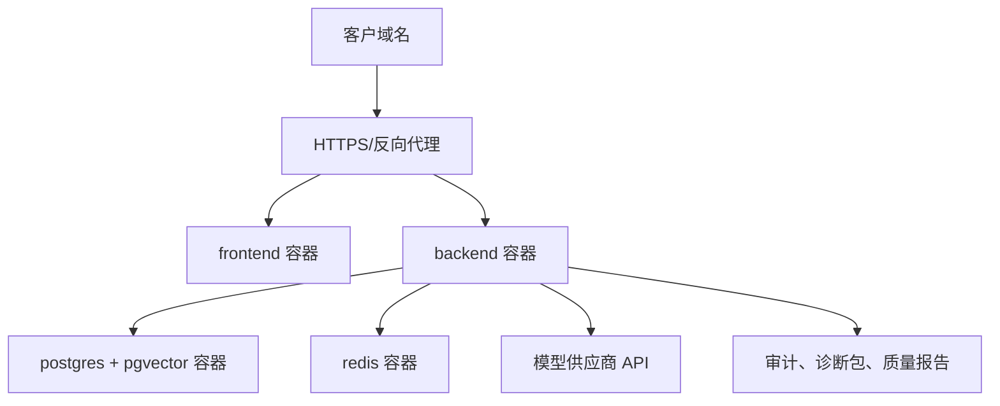

# P3-05B 托管云端版部署 Runbook

更新时间：2026-06-29  
适用范围：Lite 试点版托管云、首批标准运营版早期托管、单客户单实例  
状态：P3-05B 第二片；本文是施工 runbook，不代表真实云资源已经部署。

## 1. 结论

托管云端版近期采用“单客户单实例”最稳。不要把当前阶段包装成成熟多租户 SaaS，也不要承诺高并发 SLA。

| 层级 | 推荐用途 | 部署形态 | 是否本阶段交付 |
| --- | --- | --- | --- |
| C0 试点托管 | Lite 首批客户、售前演示、低并发官网客服 | 单台云主机 + Docker Compose + PostgreSQL/Redis 容器 + HTTPS 反向代理 | 是 |
| C1 正式托管 | 收费客户、长期小规模运营 | 版本化镜像 + 独立 PostgreSQL/pgvector + Redis + 对象存储备份 + 日志监控 | 下一阶段完善 |
| C2 SaaS 平台 | 多客户统一运营、计费和灰度 | 容器平台/Kubernetes + 多租户隔离 + 统一模型网关 + 监控告警 | 不属于当前阶段 |

## 2. 当前代码与部署边界

| 项目 | 当前真实状态 |
| --- | --- |
| 后端 | FastAPI 容器，`/health` 可做健康检查 |
| 前端 | 当前 Dockerfile 仍使用 Vite dev server，适合 C0 试点，不是最终生产静态前端形态 |
| 数据库 | PostgreSQL + pgvector 镜像路径存在；正式托管要确认目标数据库支持 pgvector |
| Redis | 当前用于队列、缓存和后续 worker 路线；C0 可容器内 Redis |
| 外发 | `OUTBOX_EXTERNAL_WRITE_ENABLED=false` 必须保持默认；真实 sender 未完成 |
| 模型 | 可配置百炼/千问，DeepSeek 备用；真实调用需客户授权和限量 smoke |
| 渠道 | 官网/自有入口优先；企业微信、公众号、电商平台必须官方授权 |

## 3. C0 试点托管架构



## 4. 云主机准备

### 4.1 建议规格

| 规模 | 建议配置 | 说明 |
| --- | --- | --- |
| 演示/内部试点 | 2 vCPU、4GB 内存、50GB SSD | 只适合低并发演示和短期试点 |
| Lite 首批客户 | 4 vCPU、8GB 内存、100GB SSD | 建议作为默认起步规格 |
| 标准运营早期 | 4-8 vCPU、16GB 内存、独立数据库 | 进入 C1 方案，应用和数据库拆开 |

### 4.2 基础要求

| 项目 | 要求 |
| --- | --- |
| 操作系统 | Linux 服务器，建议使用客户或我方运维熟悉的长期支持版本 |
| 容器环境 | Docker Engine + Docker Compose 插件 |
| 端口 | 80/443 对公网开放；后端、前端、数据库、Redis 端口默认不直接暴露公网 |
| 域名 | 客户试点域名或我方托管子域名 |
| 证书 | 使用正式 HTTPS 证书；证书申请和续期必须有负责人 |
| 备份目录 | 独立挂载或对象存储同步目录 |
| 日志 | 至少保留应用日志、容器日志和部署记录 |

## 5. 文件与命令入口

| 用途 | 文件 |
| --- | --- |
| 基础 compose | `/Users/ericlee/Desktop/肥肥lu/lite_a_customer_service/standard_ops/deploy/docker-compose.yml` |
| 试点覆盖 compose | `/Users/ericlee/Desktop/肥肥lu/lite_a_customer_service/standard_ops/deploy/docker-compose.pilot.yml` |
| 环境模板 | `/Users/ericlee/Desktop/肥肥lu/lite_a_customer_service/standard_ops/.env.example` |
| 部署准备 | `/Users/ericlee/Desktop/肥肥lu/lite_a_customer_service/standard_ops/docs/P3-05_PILOT_DEPLOYMENT_READINESS.md` |
| Lite 封版 | `/Users/ericlee/Desktop/肥肥lu/lite_a_customer_service/standard_ops/docs/P3-05B_LITE_PILOT_RELEASE_READINESS.md` |
| 诊断包 | `/Users/ericlee/Desktop/肥肥lu/lite_a_customer_service/standard_ops/scripts/create_p3_05_diagnostic_bundle.py` |

## 6. C0 试点部署步骤

### 6.1 复制和准备配置

```bash
cd /opt/wanfa/standard_ops
cp .env.example .env
```

必须修改：

| 变量 | 要求 |
| --- | --- |
| `STANDARD_OPS_ENV` | 设为 `pilot` |
| `STANDARD_OPS_ALLOWED_ORIGINS` | 只保留客户试点域名和必要调试域名 |
| `ADMIN_BOOTSTRAP_EMAIL` | 替换为交付临时管理员或客户管理员 |
| `ADMIN_BOOTSTRAP_PASSWORD` | 替换默认值，上线后要求客户修改 |
| `STANDARD_OPS_POSTGRES_PASSWORD` | 使用客户环境生成的强密码 |
| `BAILIAN_API_KEY` | 只有客户授权后填写 |
| `DEEPSEEK_API_KEY` | 只有客户授权后填写 |
| `OUTBOX_EXTERNAL_WRITE_ENABLED` | 保持 `false` |

不得写入文档或聊天记录：

- API key
- token
- webhook secret
- 私钥
- 客户聊天原文
- 数据库真实密码

### 6.2 校验 Compose 配置

```bash
cd /opt/wanfa/standard_ops
docker compose -f deploy/docker-compose.yml -f deploy/docker-compose.pilot.yml config
```

必须确认：

- `backend` 的 `OUTBOX_EXTERNAL_WRITE_ENABLED` 为 `"false"`。
- `postgres` 和 `redis` 有持久化 volume。
- `backend` 和 `frontend` 有 healthcheck。
- 没有把数据库或 Redis 端口暴露给公网安全组。

### 6.3 启动服务

```bash
docker compose -f deploy/docker-compose.yml -f deploy/docker-compose.pilot.yml up -d --build
```

启动后检查：

```bash
docker compose -f deploy/docker-compose.yml -f deploy/docker-compose.pilot.yml ps
curl -fsS http://127.0.0.1:18080/health
```

### 6.4 数据库迁移

迁移前必须备份。空库首次部署可以执行：

```bash
docker compose -f deploy/docker-compose.yml -f deploy/docker-compose.pilot.yml exec backend alembic upgrade head
```

如果不是空库，必须先记录：

| 项目 | 要求 |
| --- | --- |
| 当前版本 | Alembic 当前 revision |
| 备份文件 | `pg_dump` 文件名和校验值 |
| 回滚方式 | 回滚到上一镜像和上一数据库备份 |
| 客户授权 | 明确迁移窗口和授权人 |

### 6.5 反向代理与 HTTPS

推荐形态：

| 路径 | 目标 |
| --- | --- |
| `/` | frontend |
| `/api/` | backend |
| `/health` | backend health |
| `/api/webhooks/...` | backend webhook |

要求：

- 强制 HTTPS。
- 只允许客户域名访问。
- 后端接口 CORS 必须与 `STANDARD_OPS_ALLOWED_ORIGINS` 一致。
- webhook 回调域名必须是 HTTPS。
- 不把数据库、Redis、Docker API 暴露公网。

## 7. C1 正式托管升级口径

C0 跑通后，正式托管不应长期停在同一台机器全容器形态。C1 升级建议：

| 组件 | C0 | C1 |
| --- | --- | --- |
| 前端 | Vite dev server 容器 | 静态构建产物 + Nginx/对象存储/CDN |
| 后端 | 单 API 容器 | API 容器 + worker 容器拆分 |
| 数据库 | 容器 PostgreSQL | 独立 PostgreSQL，确认 pgvector 支持 |
| Redis | 容器 Redis | 独立 Redis |
| 备份 | 主机脚本 | 自动备份 + 对象存储 + 恢复演练 |
| 日志 | Docker logs | 集中日志和告警 |
| 密钥 | `.env` | Secret 管理或客户侧密钥管理 |
| 发布 | 手工 up | 版本化镜像、变更单、回滚包 |

## 8. 备份与恢复

### 8.1 备份对象

| 对象 | 内容 |
| --- | --- |
| 数据库 | 租户、账号、会话、消息、知识库、评测、outbox、审计 |
| 配置 | `.env` 的客户侧安全副本，不进入我方长期文档 |
| 知识资料 | 原始知识文件、版本记录、禁用话术、题库 |
| 报告 | 质量报告、诊断包、部署记录 |

### 8.2 备份命令示例

```bash
docker compose -f deploy/docker-compose.yml -f deploy/docker-compose.pilot.yml exec postgres \
  pg_dump -U wanfa_ops -d wanfa_ops -Fc -f /tmp/wanfa_ops_YYYYMMDD_HHMMSS.dump

docker compose -f deploy/docker-compose.yml -f deploy/docker-compose.pilot.yml cp \
  postgres:/tmp/wanfa_ops_YYYYMMDD_HHMMSS.dump ./backups/
```

### 8.3 恢复演练

恢复演练必须指向一次性演练库，不得默认指向生产库。

记录：

- 备份文件名。
- 文件校验值。
- 恢复目标库。
- 抽查表。
- 抽查结果。
- 演练库删除确认。

## 9. 模型 key 与成本控制

| 项目 | 要求 |
| --- | --- |
| key 来源 | 客户授权或合同约定由我方代管 |
| key 保存 | 不进入仓库、文档、聊天记录 |
| 首次 smoke | 小样本、限量、记录 provider/model/latency/error |
| 批量评测 | 必须额外授权 |
| fallback | 百炼不可用时可走 DeepSeek；显式 provider 失败不能静默假装成功 |
| 成本报告 | 标准运营版再形成 provider/model/route 统计 |

## 10. 上线前 Smoke

| 检查 | 命令或方式 |
| --- | --- |
| Compose 配置 | `docker compose -f deploy/docker-compose.yml -f deploy/docker-compose.pilot.yml config` |
| 服务状态 | `docker compose ... ps` |
| 后端健康 | `curl -fsS http://127.0.0.1:18080/health` |
| 登录页 | 浏览器打开客户域名 |
| 知识导入 | 导入 Lite 知识包 |
| 文档检索 | 搜索 3-5 个试点问题 |
| AI 草稿 | 小样本生成，低置信进入人审 |
| Outbox | 确认真实外发关闭 |
| 诊断包 | 生成脱敏诊断包 |

## 11. 回滚

任何版本升级前必须具备：

| 回滚对象 | 回滚方式 |
| --- | --- |
| 应用镜像 | 回到上一版本镜像 tag |
| Compose | 回到上一份 compose 文件 |
| 数据库 | 恢复升级前备份 |
| 知识库 | 回滚上一知识版本 |
| 模型路由 | 回到上一 provider/model 配置 |
| 外发 | 立即保持或恢复 `OUTBOX_EXTERNAL_WRITE_ENABLED=false` |

触发回滚：

- 健康检查失败。
- 登录不可用。
- 数据迁移异常。
- 题库回归明显下降。
- 外发门禁异常。
- 模型/provider 失败率异常。

## 12. 当前未完成项

| 未完成项 | 影响 |
| --- | --- |
| 前端生产静态化容器 | C0 可试点，C1 前需改造 |
| 独立生产 worker | 当前不能承诺高并发队列处理 |
| 真实 sender | 当前不能承诺自动真实外发 |
| 监控告警 | C0 只能基础日志和诊断包 |
| 官方平台 sandbox | 真实平台接入仍需客户授权 |
| 真实客户题库 | 质量验收仍需客户脱敏问题和人工标签 |

## Stage Completion

- Stage: P3-05B 托管云端版 runbook。
- What changed: 新增托管云端版 C0/C1 部署 runbook，明确 Compose 试点、正式托管升级、HTTPS、数据库、Redis、备份、模型 key、smoke 和回滚。
- What was verified: `docker compose -f deploy/docker-compose.yml -f deploy/docker-compose.pilot.yml config --quiet` 通过；`python3 scripts/check_p3_05_deployment_readiness.py` 通过；文档关键词检查已覆盖 `C0`、`C1`、`OUTBOX_EXTERNAL_WRITE_ENABLED`、`HTTPS`、`PostgreSQL`、`Redis`、`备份`、`回滚` 和 `模型 key`。
- What remains not done: 真实云资源部署、反向代理实际配置、托管数据库创建、真实模型 key smoke、真实客户环境迁移。
- Whether this was customer-visible: 间接是。本文是内部施工手册，但可整理成客户部署说明。
- Whether this was only evaluation: 否。
- Next stage: Lite 知识包模板、Lite 题库模板和工作台最终浏览器 QA。
