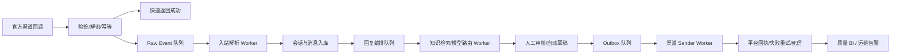
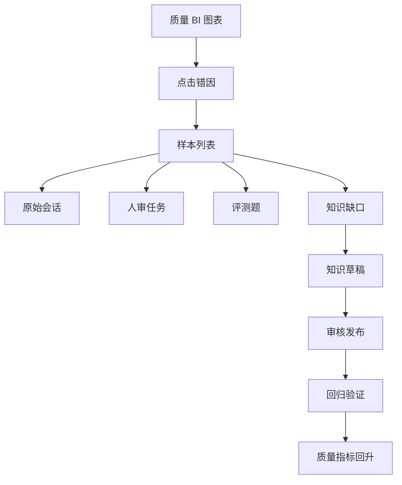
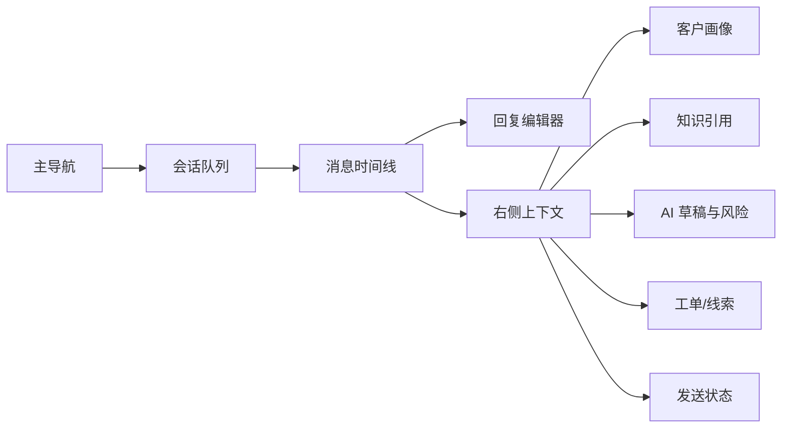

# P3-05O 客服中台可运作性、高并发与市场对标复盘

日期：2026-07-01  
对象：万法常世 AI 全智能客服系统 `standard_ops`  
结论等级：受控试点可继续推进，不能称为成熟可规模化商用中台

## 1. 本轮审查方式

本轮按“多子 agent + 主线程复核 + 市场公开信息对标”的方式完成。

已返回的子 agent 结论：

| 审查线 | 结论 |
|---|---|
| 后端并发与生产闭环 | 当前是商用前骨架，不是大规模生产运行闭环；缺独立生产 worker、真实 sender、硬幂等、分布式限流、队列观测、死信重放。 |
| 前端对话台与质量 BI | 当前页面有工作台雏形，但更像功能验收台；对话台布局和真实坐席效率不足，质量复盘还不是可下钻的 BI。 |
| 业务闭环与 P3-05P | 当前内部链路能跑通 dry-run，但不是真实渠道闭环；P3-05P 不是 Lite 当前主线强必要项，应拆成标准版小切片和企业版增强项。 |

市场横向子 agent 长时间未返回，本轮未把它作为有效结论；主线程使用公开官网信息补做对标。参考来源包括：

- [Chatwoot Features](https://www.chatwoot.com/features)
- [Zendesk AI](https://www.zendesk.com/ai/)
- [Zendesk Agent Workspace](https://www.zendesk.com/service/agent-workspace/)
- [Zendesk Quality Assurance](https://www.zendesk.com/service/quality-assurance/)
- [Intercom Fin](https://www.intercom.com/fin)
- [Freshdesk](https://www.freshworks.com/freshdesk/)
- [Udesk 沃丰科技](https://www.udesk.cn/)
- [智齿科技](https://www.sobot.com/)
- [美洽](https://meiqia.com/)
- [网易七鱼](https://qiyukf.com/)

## 2. 一句话结论

当前系统可以算“试点型 AI 客服中台骨架”，不可以算“成熟商用全渠道客服中台”。

它已经具备了认证、会话、人工审核、待发送、知识库、知识缺口、评测、联系人、线索、基础工单、企业微信 inbound sandbox、模型路由和 dry-run outbox 的骨架。但核心短板也很明确：

1. 对话台还不像成熟坐席每天真正工作的主界面。
2. 质量复盘还没有变成“错因定位 -> 样本下钻 -> 修复动作 -> 回归验证”的 BI 闭环。
3. 高并发没有解决，仍缺生产级 worker、队列、硬幂等、真实 sender、限流、告警、死信。
4. 真实渠道只做到 inbound/sandbox 和 dry-run，尚未做到真实外发与平台回执闭环。
5. 知识缺口可以发现和生成草稿，但“审核发布 -> 回归通过 -> 再用于回答”的强闭环还没完全做实。

## 3. 阶段评分

| 维度 | 当前评分 | 判断 |
|---|---:|---|
| 总体产品成熟度 | 6.1 / 10 | 可继续做试点演示，不适合直接承诺成熟商用。 |
| 对话台可用性 | 5.8 / 10 | 三栏雏形存在，但真实消息流、队列筛选、坐席动作和视觉层次还不够。 |
| 质量复盘 / BI | 5.2 / 10 | 有指标卡和口径表，但缺图表、错因聚类、趋势和样本下钻。 |
| 后端业务闭环 | 6.3 / 10 | 内部 dry-run 闭环较完整，真实渠道闭环未完成。 |
| 知识库与评测 | 6.8 / 10 | 文档、分块、评测、缺口都有基础；知识审核发布流仍是短板。 |
| 模型路由 | 6.5 / 10 | 路由策略和百炼 smoke 已有，但缺生产调用账本、熔断、并发治理和真实质量大样本。 |
| 高并发与生产运行 | 3.2 / 10 | 当前不具备大规模并发承诺条件。 |
| 市场竞争观感 | 5.6 / 10 | 功能骨架接近方向，但 UI、报表、渠道闭环和坐席效率离成熟产品仍有距离。 |

## 4. 市场成熟客服中台的共同能力

从 Chatwoot、Zendesk、Intercom、Freshdesk，以及 Udesk、智齿、美洽、网易七鱼等公开产品页看，成熟客服中台通常不是只有“AI 回答问题”，而是至少包含以下八个板块。

| 成熟能力 | 市场常见形态 | 我们当前状态 |
|---|---|---|
| 全渠道统一收件箱 | 官网、邮件、社媒、微信生态、App、海外 IM 等统一进会话池；支持分配、优先级、标签、筛选。 | 有 conversation inbox 和渠道字段，但真实外部渠道有限，列表查询仍有内存分页问题。 |
| 坐席对话台 | 左侧会话队列，中间消息流，右侧客户画像/订单/知识/AI 草稿/工单；支持接管、转派、备注、快捷回复。 | 已有三栏雏形，但消息流是合成式，右侧信息组织不够强，视觉和效率不足。 |
| AI 助手 / AI Agent | 自动回答、草稿生成、摘要、意图识别、知识推荐、风险转人工。 | 有模型路由、草稿、人审门禁，但真实质量评估和生产并发调用未完成。 |
| 自建知识库 | FAQ、文档、引用来源、版本、审核、发布、回归测试。 | 文档 RAG、分块、评测、缺口都有基础；知识发布和版本回滚不够强。 |
| 工单与 SLA | 跨部门工单、SLA、升级、重开、内部评论、附件、统计。 | 有基础工单和轻量 SLA；P3-05P 的高级能力尚未完成。 |
| 数据分析与质检 | 会话量、转人工率、首响、解决率、满意度、机器人命中、错因、质检、趋势。 | 质量复盘现在偏“指标说明”，还不是 BI。 |
| 渠道健康与外发闭环 | 官方 API、授权状态、限流、回执、失败重试、死信、告警。 | 有 webhook、connector、outbox/job 骨架；真实 sender 和生产队列未完成。 |
| 安全与运营 | 登录、RBAC、多租户、审计、权限、数据脱敏、部署运维。 | 认证/RBAC/审计已有；多租户生产隔离、运维告警和客户级配置仍需加强。 |

## 5. 当前中台是否能很好运作

答案要分层看。

可以运作的部分：

1. 本地前后端可以启动，健康检查返回正常。
2. 登录、RBAC、审计、知识库、评测、人工审核、outbox dry-run、联系人、线索、基础工单这些内部模块已经有工程形态。
3. 对话台已经能展示会话列表、对话区域、AI 草稿、知识证据和处理动作。
4. 质量复盘已经能把人审、知识命中、失败队列和题库回归纳入同一页。

不能称为成熟运作的部分：

1. 坐席每天处理大量客户时，当前对话台效率不够：筛选、分组、消息流、快捷动作、右侧证据、工单联动都还不够成熟。
2. 当前页面还会暴露不少“演示边界文案”，对正式客户会显得像研发验收台。
3. 质量复盘没有图表型 BI，也没有点击某个错因后直接进入样本、会话、知识缺口和修复动作。
4. 外发是 dry-run，真实发送和回执没有打通，因此不能承诺微信、企微、抖音、小红书、淘宝、京东等真实平台自动回复。
5. 高并发链路不成立，不能承诺大公司量级消息压力。

当前合格定义应该是：试点型中台合格度约 70%，成熟商用中台合格度约 55%。

## 6. 高并发现在怎么解决

当前没有真正解决高并发，只是有了未来生产化需要的部分数据结构和接口骨架。

现状风险：

| 层级 | 当前情况 | 风险 |
|---|---|---|
| Webhook 入站 | 有签名、解密、可信入站骨架 | 还不是快 ACK + 入队 + 后台消费的生产模式。 |
| 队列 | 有 outbox delivery job 表 | claim 不是生产级原子锁，缺 Redis Stream / Celery / RQ / SKIP LOCKED 消费模型。 |
| Worker | 主要是 API 触发或服务内函数 | 没有独立 worker 容器和水平扩展。 |
| 数据库 | Postgres/pgvector 方向正确 | 连接池、超时、索引、热查询聚合不足；会话 inbox 存在先拉全量再内存分页的问题。 |
| 模型调用 | OpenAI-compatible 调用存在 | 同步 HTTP 调用，缺调用队列、并发上限、熔断、预算、降级和调用账本。 |
| Outbox | 有草稿、attempt、job | 真实 sender 未实现，真实外发被 kill switch 阻断。 |
| 限流 | 有 batch 截断 | 不是分租户、分渠道、分 provider 的分布式限流。 |
| 观测 | 有审计 | 缺队列深度、错误率、延迟、模型失败率、渠道失败率、告警、DLQ 重放。 |

生产级高并发需要按这个架构补齐：

最小生产改造项：

1. 独立 worker 容器：入站 worker、模型 worker、outbox sender worker 分开部署。
2. 队列系统：短期可用 Redis RQ / Celery / Arq；Postgres 方案必须使用 `FOR UPDATE SKIP LOCKED` 原子 claim。
3. 快 ACK：平台 webhook 请求只验签、记录和入队，不在回调线程里跑 AI。
4. 硬幂等：webhook event、external message id、workflow run、outbox job 都要唯一键。
5. 分布式限流：按租户、渠道、客服账号、模型 provider 做 token bucket。
6. 模型调用治理：异步调用、超时、熔断、fallback、成本记录、失败降级。
7. 真实 sender：至少先打通一个官方 sandbox 渠道，保留 kill switch。
8. 观测告警：队列堆积、失败率、模型超时、渠道限流、死信数量必须可视化。
9. 压测：用 synthetic webhook + synthetic conversations 做 1、10、50、100、500 并发阶梯压测，不能凭代码形态宣称高并发。

## 7. P3-05P 是否极强必要

P3-05P 不应该作为当前最强必要项。

如果 P3-05P 指“高级 SLA、工单评论、附件、重开流程”，它的优先级应该拆开看：

| 版本 | P3-05P 必要性 | 处理方式 |
|---|---|---|
| Lite 试点版 | 低到中 | 不需要高级 SLA 和附件；最多保留基础工单、备注、状态。 |
| 标准运营版 | 中 | 需要一个 mini 版：内部评论、重开、审计、SLA 状态更清晰。 |
| 企业增强版 | 高 | 需要完整 SLA、升级、附件、权限、跨部门工单、工单报表。 |

当前最应该优先推进的是：

1. 对话台主工作区重构。
2. 质量复盘改成错因 BI。
3. 知识缺口到知识发布到回归通过的强闭环。
4. 生产 worker、队列、真实 sender 和高并发底座。

因此建议把 P3-05P 改成：

- `P3-05P-mini`：工单内部评论、独立重开动作、审计记录。
- 附件、高级 SLA、复杂升级策略延期到企业增强版。

## 8. 质量复盘应该改成什么

用户提出的方向是对的：质量复盘不是写一堆指标，而是要找错因，并把错因导向人工修复。

应该改成“质量 BI + 错因闭环”。

核心图表：

| 图表 | 作用 |
|---|---|
| 错因 Pareto | 看最大问题来自无知识、低置信、引用缺失、提示词问题、平台失败还是风险转人工。 |
| 质量漏斗 | 入站会话 -> 知识命中 -> AI 草稿 -> 人审通过 -> 待发送 -> 发送成功 -> 解决。 |
| 知识覆盖热力图 | 按产品线、问题类型、渠道看知识缺口。 |
| 置信度散点图 | 找到“低置信但有知识”“高置信但人审失败”的异常区。 |
| 趋势折线 | 每日/每周强证据命中、转人工、失败、投诉风险变化。 |
| 渠道失败堆叠图 | 分渠道展示限流、授权失败、接收人不可达、内容拒绝。 |
| 人审结果矩阵 | AI 草稿通过、修改、驳回、转工单、补知识的比例。 |

错因到修复动作：

| 错因 | 应进入哪里修复 |
|---|---|
| 无知识命中 | 创建知识缺口，补知识卡片或文档。 |
| 期望词缺失 | 修改 FAQ、补售后/价格/交付条款。 |
| 有知识但引用不准 | 调整分块、检索参数、重排器或引用模板。 |
| 低置信但命中知识 | 调整提示词、答案结构和模型路由。 |
| 高风险误自动化 | 收紧风险策略，强制转人工。 |
| 平台发送失败 | 进入渠道健康和 outbox 失败复盘。 |
| SLA 超时 | 进入工单、排班、分配策略优化。 |

理想下钻路径：

## 9. 对话台应该怎么重做

当前对话台已经有方向，但视觉和布局还不够成熟。成熟客服产品的主工作界面应该是“操作效率优先”，不是“模块展示优先”。

建议改成四层：

1. 顶部状态条：今日未接、超时、高风险、无知识、发送失败、渠道异常。
2. 左侧主导航：工作台、质量、知识、渠道、设置，减少当前过多同级入口。
3. 中间会话工作区：
   - 第二列：会话队列，支持我的、未分配、待审核、SLA 超时、高风险、无知识、发送失败。
   - 第三列：真实消息时间线，显示客户消息、AI 草稿、人工回复、系统事件、工单事件、发送回执。
   - 底部：坐席编辑器，支持采纳草稿、修改、重新生成、插入知识、转人工、建工单、留资。
4. 右侧上下文侧栏：
   - 客户画像
   - AI 草稿版本
   - 命中知识和引用
   - 风险判断
   - 工单 / 线索
   - 渠道发送状态

新的对话台信息架构：

## 10. 需要删除或降级的功能观感

当前有些功能不是不能做，而是不应该放在主导航显眼位置，否则会显得“什么都有，但都不深”。

建议：

1. `模型` 页面降级为设置/治理子页，除非有真实调用量、成本、延迟、失败率和路由命中统计。
2. `设置` 当前仍是规划态，不应像客户可操作功能一样展示。
3. `线索` 保留轻量能力，不要做成重 CRM。
4. `渠道` 不要展示成“已全渠道接通”，应明确是官方授权状态、回调状态、外发状态、失败状态。
5. 质量页不要写“漂亮大屏不是目标”这种内部口吻；正式产品应直接呈现 BI 和修复入口。

## 11. 下一步工程优先级

推荐把下一阶段从 P3-05P 改为以下顺序。

| 顺序 | 阶段 | 目标 | 必要性 |
|---:|---|---|---|
| 1 | P3-05Q | 重构对话台主工作区，让它像真正客服坐席每天使用的界面。 | 极高 |
| 2 | P3-05R | 把质量复盘升级为错因 BI + 下钻 + 修复动作。 | 极高 |
| 3 | P3-05S | 知识缺口 -> 知识草稿 -> 审核发布 -> 回归通过 -> 再进入回答。 | 极高 |
| 4 | P3-06A | 生产 worker、队列、硬幂等、分布式限流、真实 sender 骨架。 | 极高 |
| 5 | P3-06B | 单个官方渠道 sandbox 端到端：入站、草稿、人审、外发、回执、失败重试。 | 高 |
| 6 | P3-05P-mini | 工单评论、重开、审计；附件和高级 SLA 暂缓。 | 中 |

## 12. 当前是否是合格中台

如果标准是“能不能内部演示和小范围试点”，答案是基本合格，但还需要 UI/BI 精修和真实渠道 smoke。

如果标准是“能不能作为成熟商用客服中台交给客户长期使用”，答案是不合格。

不合格不是因为方向错，而是因为几个关键环节仍没闭合：

1. 真实渠道自动回复没有闭合。
2. 高并发没有闭合。
3. 质量 BI 没有闭合。
4. 知识发布回归没有闭合。
5. 对话台还没有达到成熟产品的坐席效率。

## 13. 推荐立刻执行的修复任务

### P3-05Q：对话台重构

交付标准：

1. 会话队列按“我的、未分配、待审核、超时、高风险、无知识、发送失败”分组。
2. 消息时间线显示真实事件类型，而不是三条合成消息。
3. 右侧上下文显示客户、知识、AI、工单、线索、发送状态。
4. 坐席操作集中到编辑器和顶部动作栏。
5. 移动端不作为主场景，但 1280、1440、1920 桌面宽度必须舒服。

### P3-05R：质量 BI 重构

交付标准：

1. 至少 6 个图表：错因 Pareto、质量漏斗、知识覆盖热力图、趋势线、渠道失败堆叠、人审结果矩阵。
2. 每个图表能下钻到样本列表。
3. 样本能跳转会话、人审、知识缺口、评测题。
4. 每个错因有推荐修复动作。
5. 不宣称完整准确率，除非存在人工事实性标签。

### P3-05S：知识发布闭环

交付标准：

1. 知识草稿不能直接等于已解决。
2. 必须经过审核发布。
3. 发布后生成或绑定回归题。
4. 回归通过后，知识缺口才能标记为解决。
5. 质量 BI 能展示修复前后指标变化。

### P3-06A：生产并发底座

交付标准：

1. 独立 worker 容器。
2. 队列原子 claim。
3. webhook 快 ACK。
4. outbox 真实 sender 抽象。
5. 分布式限流。
6. 死信队列。
7. 健康检查覆盖 DB、Redis、队列、模型 provider、渠道 provider。
8. 至少一轮阶梯压测报告。

## 14. 对外口径

现在可以说：

> 系统已完成标准运营版的核心工程骨架，具备知识库、AI 草稿、人审、待发送、质量评测、基础工单、联系人线索和渠道接入准备能力，适合进入受控试点。

现在不能说：

> 已完成成熟全渠道自动回复客服中台。

也不能说：

> 已支持高并发、多平台真实自动回复、完整准确率证明、成熟 BI 质检和企业级工单 SLA。

## 15. 主判断

P3-05P 不是当前最大的瓶颈。  
最大的瓶颈是：产品主界面不够成熟、质量复盘不能定位错因、高并发底座未完成、真实渠道外发未闭环。

下一步应先做 P3-05Q、P3-05R、P3-05S 和 P3-06A，再做 P3-05P-mini。
