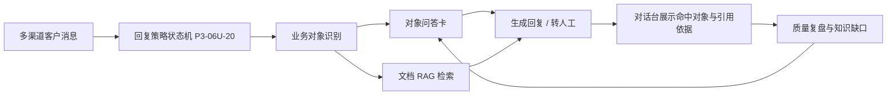

# P3-06U-19 业务对象知识库底座

## 阶段定位

本阶段把智能客服的知识库从“泛 FAQ / 文档片段”升级为“业务对象 + 对象问答卡”的结构。

业务对象包括商品、服务、套餐、课程、项目、门店。对象问答卡负责描述客户围绕某个对象会怎么问、标准答案是什么、触发关键词是什么、适用范围是什么。

这一步不是渠道外发，也不是回复状态机。它是后续自动回复、质量复盘、知识缺口归因和多渠道对话台展示命中依据的底座。

## 本阶段新增能力

1. 后端新增业务对象表结构：
   - `business_objects`
   - `business_object_aliases`
   - `object_knowledge_cards`
   - `knowledge_import_batches`

2. 后端新增接口：
   - `POST /api/tenants/{tenant_id}/business-objects`
   - `GET /api/tenants/{tenant_id}/business-objects`
   - `POST /api/business-objects/{business_object_id}/knowledge-cards`
   - `GET /api/business-objects/{business_object_id}/knowledge-cards`

3. 前端知识运营页新增“业务对象知识库”区：
   - 可创建商品、服务、套餐等对象
   - 可录入对象别名和触发说法
   - 可为对象绑定专属问答卡
   - 演示数据覆盖商品、服务、套餐三类对象

4. 权限边界：
   - 管理员/负责人可创建业务对象和对象问答卡
   - 普通坐席可读取，但不能新增或修改

## 与当前系统的连接关系

## 还没有完成的部分

1. 业务对象尚未接入正式回复策略状态机。
2. 对象问答卡尚未参与 BM25 / 向量混合检索。
3. 知识缺口尚未自动归因到具体业务对象。
4. 批量导入表已预留，但还没有 CSV / 表格导入接口。
5. 多渠道对话台尚未展示真实命中对象和卡片引用。

## 下一阶段建议

进入 P3-06U-20：回复策略状态机。

重点是把客户消息变成明确状态：

1. 识别是否命中业务对象。
2. 高置信对象问答卡直接自动回复。
3. 命中对象但缺答案，进入知识缺口。
4. 低置信、风险、价格争议、投诉等进入人工接管。
5. 对话台展示：命中对象、命中卡片、置信度、是否已自动回复、是否需要人工处理。

## 验收口径

本阶段完成的标准：

1. 后端能创建商品、服务、套餐三类对象。
2. 后端能给业务对象绑定问答卡。
3. 普通坐席不能创建对象或问答卡。
4. 前端知识运营页能展示业务对象和对象问答卡。
5. 静态检查和后端知识接口测试通过。
