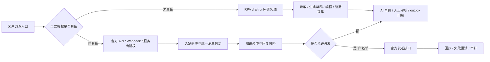

# P3-06U-26G 渠道官方 sandbox 与 RPA draft-only 边界

更新时间：2026-07-02

本文用于固化下一阶段渠道接入工程边界：正式交付线只走官方授权、服务商授权或测试白名单 sandbox；RPA 继续作为内部研究线和坐席副驾驶，不进入正式默认交付链。

## 1. 本片结论

- 渠道中心必须同时展示“官方 sandbox 优先级”和“RPA draft-only 边界”。
- RPA 不进入正式默认交付链，不写成平台自动回复能力，不绕过官方授权。
- 真实外发继续关闭。任何真实平台外发都需要官方授权、测试白名单、outbox、人工或策略门禁、回执、失败重试和审计闭环。
- 当前不会做个人号外挂、Hook、群控、Cookie 复用、私有协议或商家后台模拟点击发送。

## 2. 依据文件

| 文件 | 本片吸收的结论 |
| --- | --- |
| `P3-06U-26_ENGINEERING_OPTIMIZATION_MASTER_PLAN.md` | P3-06U-26G 的目标是把正式渠道线和 RPA 研究线彻底分开。 |
| `P3-05C_OFFICIAL_CHANNEL_AUTOREPLY_READINESS.md` | 真实自动回复必须按官方渠道逐个验收，不能笼统承诺全平台已接通。 |
| `P3-05D_CHANNEL_TEST_PREPARATION_GUIDE.md` | 企业微信、公众号、抖音、电商平台的后台准备和测试信息各不相同，必须先拿到官方配置和测试账号。 |
| `P3-06U-12_AI_RPA_REPLY_STRATEGY_INTEGRATION_PLAN.md` | RPA 可用于策略验证、草稿填框和证据采集，但不等于平台授权，也不等于账号安全。 |
| `P3-06U-26C_CHANNEL_ACCOUNT_CONFIGURATION_PANEL.md` | 渠道账号/店铺配置只保存低敏身份字段，不保存 Secret、Token、Cookie。 |

## 3. 外部官方参考

- 企业微信 / 微信客服：官方文档入口 `https://open.work.weixin.qq.com/api/doc/90000/90135/94670`；配置通常涉及 URL、Token、EncodingAESKey、可信 IP、access token 和微信客服权限。
- 微信公众号：公众平台开发文档 `https://developers.weixin.qq.com/doc/offiaccount/Getting_Started/Overview.html`，客服消息能力见 `https://developers.weixin.qq.com/doc/offiaccount/Message_Management/Service_Center_messages.html`。
- 抖音开放平台：私信发送接口 `https://developer.open-douyin.com/docs/resource/zh-CN/dop/develop/openapi/interaction-management/private-message/send-msg`，Webhook 事件列表 `https://developer.open-douyin.com/docs/resource/zh-CN/dop/develop/webhooks/event-list`。
- 小红书开放平台：开发者协议 `https://open.xiaohongshu.com/document/developer/file/4`，商业私信工具需按官方商业平台或服务商资料确认。
- 淘宝开放平台：`https://open.taobao.com/`。
- 京东 JOS：客服机器人基础包 `https://jos.jd.com/apilist?apiGroupId=952&apiGroupName=%E5%AE%A2%E6%9C%8D%E6%9C%BA%E5%99%A8%E4%BA%BA-%E5%9F%BA%E7%A1%80%E5%8C%85`。
- 拼多多开放平台：`https://open.pinduoduo.com/`。

说明：以上链接只作为接入路线参考。每个客户项目仍需在对应后台核验当前主体、类目、权限包、服务商授权和平台最新规则。

## 4. 正式线与研究线



正式线是客户交付候选，研究线只服务内部验证和坐席辅助。两条线可以共用回复策略和统一消息信封，但不能共用“已接通、已外发、已授权”的状态表达。

## 5. 渠道优先级矩阵

| 渠道 | 优先级 | 正式接入方式 | 当前状态 | RPA 边界 |
| --- | --- | --- | --- | --- |
| 企业微信 / 微信客服 | 第一优先级 | 官方回调、URL 验证、AES 解密、可信 IP、白名单发送 | sandbox 优先，真实外发继续关闭 | 不使用个人微信外挂、Hook、群控或模拟点击 |
| 微信公众号 | 第二优先级 | 公众号后台服务器配置、消息加解密、客服消息能力 | 待测试号或服务号权限 | 不模拟个人微信聊天窗口，不托管个人号 |
| 抖音 / 抖店 | 第三优先级 | 抖音开放平台、抖店/飞鸽官方能力或服务商授权 | 未接入，待权限包确认 | 网页私信只能做 draft-only 研究，不能写成商家客服接通 |
| 小红书 | 第四优先级 | 开放平台、商业私信工具或官方服务商授权 | 未接入，待主体和权限确认 | 不使用账号托管、Cookie 复用或后台模拟发送 |
| 淘宝 / 天猫 / 京东 / 拼多多 | 逐平台专项 | 开放平台、店铺授权、服务市场或客服机器人官方包 | 未接入，需单平台验收 | 商家后台 RPA 只允许草稿和证据采集，不默认点击发送 |

## 6. 前端落点

### 6.1 渠道中心

渠道中心新增“官方 sandbox 优先级”矩阵，必须展示：

- 官方授权优先。
- 每个渠道的正式线。
- 当前状态。
- RPA draft-only 边界。
- 真实外发继续关闭。

### 6.2 RPA Lab

RPA Lab 必须继续展示为内部实验入口，并明确：

- 只允许读取页面上下文。
- 只允许生成草稿。
- 只允许填入回复框或复制草稿。
- 可采集动作证据。
- 不点击发送。
- RPA 不进入正式默认交付链。

## 7. 后端与数据边界

本片不新增后端表，不打开外发开关。后续如进入真实官方 sandbox，必须先补齐：

- `channel_accounts` 低敏身份配置。
- 密钥只进入服务端 Secret 管理。
- 统一消息信封。
- 入站验签和幂等。
- `reply_decisions` 回复决策。
- `outbox` 门禁。
- 官方平台发送回执。
- 失败重试和人工复盘。
- 审计事件。

## 8. 验收

```bash
.venv/bin/python scripts/check_p3_06u_26g_channel_sandbox_rpa_boundary.py
cd frontend && npm run typecheck
cd frontend && npm run build
CHROME_DEBUGGING_URL=http://127.0.0.1:9227 FRONTEND_URL=http://127.0.0.1:5182/?demo=1 node scripts/check_p3_06u_26g_channel_sandbox_rpa_boundary.mjs
```

## 9. 停止条件

出现以下任一情况，必须停止：

- RPA 被写成默认正式交付链。
- 非官方模拟点击被写成自动回复能力。
- 个人号外挂、Hook、群控、Cookie 复用或私有协议进入正式方案。
- 真实外发关闭提示被移除。
- 没有官方授权、测试白名单、回执、失败重试和审计闭环，就宣称真实平台自动回复已接通。

## 10. 下一步

进入 `P3-06U-26H`：部署运维、客户账号、诊断包、备份恢复、告警和月度质量复盘收束。

并行专项可以继续准备企业微信 / 微信客服官方公网 HTTPS 回调 smoke，但必须保持真实外发关闭，直到用户单独授权。
