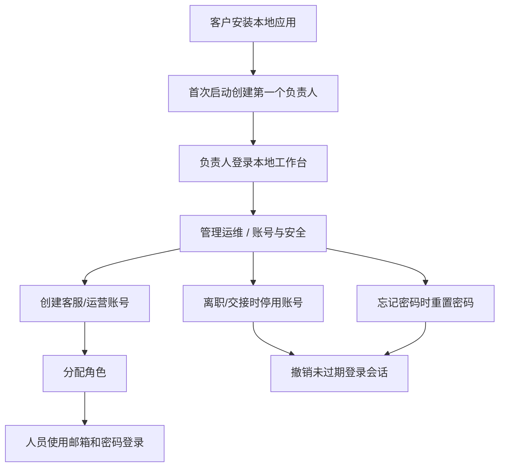

# P3-06U-26H2B 本地账号治理第一片

## 阶段定位

- Stage: P3-06U-26H2B
- 日期: 2026-07-02
- 范围: 客户本地部署后的人员账号治理第一片
- 目标: 让本地工作台不再只支持“首次创建负责人 + 登录”，而是支持负责人在系统内创建、启停和维护后续人员账号。

## 本轮完成

### 后端能力

已在账号接口层补齐客户侧账号治理所需的第一组动作：

1. 租户用户列表返回用户角色。
2. 负责人可创建新的本地人员账号。
3. 负责人可给新人员分配角色。
4. 负责人可停用或重新启用人员账号。
5. 负责人可重置人员密码。
6. 停用账号或重置密码时，会撤销该人员未过期登录会话。
7. 最后一名启用中的负责人不能被停用。
8. 普通坐席不能管理账号。
9. 创建、停用、重置密码都会写入审计事件。

涉及文件：

- `backend/app/api/accounts.py`
- `backend/app/schemas/foundation.py`
- `backend/tests/test_accounts_api.py`

### 前端能力

已在“管理运维 -> 账号与安全”接入真实账号治理界面：

1. 显示全部账号、启用账号、负责人账号、停用账号数量。
2. 显示人员列表、邮箱、角色、状态和创建时间。
3. 支持新增人员：姓名、邮箱、初始密码、角色。
4. 支持停用/启用账号。
5. 支持重置密码。
6. 没有 `accounts.manage` 权限时只显示权限提示，不触发账号管理接口。
7. 演示态不伪造账号治理数据，避免把样例数据误当成真实客户账号。

涉及文件：

- `frontend/src/api/client.ts`
- `frontend/src/App.tsx`
- `frontend/src/styles.css`

## 当前客户侧使用逻辑



## 角色边界

| 角色 | 当前账号治理能力 |
| --- | --- |
| 负责人 owner | 可创建、启停、重置人员账号；不可停用最后一个启用负责人 |
| 管理员 admin | 当前是否具备账号治理取决于后端权限集合中的 `accounts.manage` |
| 客服 agent | 不可管理账号 |
| 只读 viewer | 不可管理账号 |

## 验证结果

已执行：

```bash
npm --prefix frontend run typecheck
npm --prefix frontend run build
cd backend && .venv/bin/python -m pytest tests/test_accounts_api.py tests/test_p3_06j_accounts_rbac_bootstrap.py tests/test_auth_rbac_audit.py tests/test_local_setup_api.py -q
```

结果：

- 前端 TypeScript 检查通过。
- 前端生产构建通过。
- 后端账号、RBAC、本地初始化和登录审计相关测试 `20 passed`。
- 仍有一个既有 Starlette TestClient 弃用警告，不影响本轮功能。
- Vite 仍提示既有大 chunk 警告，属于当前前端体积问题，不是本轮账号治理回归。

## 明确未完成

本轮是账号治理第一片，不等于完整客户运维闭环完成：

1. 未做员工自助注册申请。
2. 未做负责人审批队列。
3. 未做按组织/门店/团队批量分配。
4. 未做诊断包生成。
5. 未做诊断包上传。
6. 未做知识更新包导入。
7. 未做签名程序更新包导入。
8. 未做备份恢复演练。
9. 未开启真实平台外发。

## 下一步建议

### P3-06U-26H2C 诊断包生成第一片

先做本地只读诊断包，不上传、不联网，默认导出：

- 系统版本、数据库迁移版本、运行环境摘要。
- 最近健康检查状态。
- 最近知识评测摘要。
- 最近失败队列和错误类型摘要。
- 账号数量、渠道配置数量、知识文档数量。
- 明确排除 `.env` 明文、API key、token、cookie、密码、私钥和完整客户聊天原文。

### P3-06U-26H2D 知识更新包导入第一片

用于解决客户命中率下降：

- 客户导出诊断包。
- 我方分析知识缺口。
- 我方回传知识更新包。
- 客户负责人本地导入。
- 系统执行发布前评测和回归。
- 通过后发布，不通过则保留旧版本。

### P3-06U-26H2E 签名程序更新包设计

用于软件缺陷、安全修复和数据库结构升级：

- 更新包签名。
- 版本兼容预检。
- 更新前备份。
- 更新后健康检查。
- 失败自动回滚。

