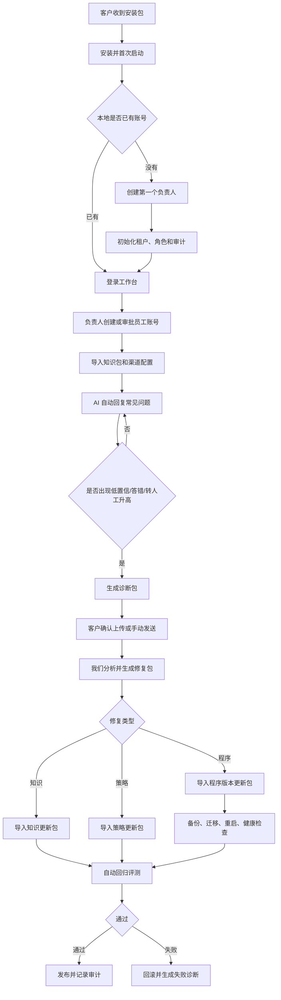

# P3-06U-26H2 本地应用账号治理与远程运维模型

## Engineering Control Card

- Stage: P3-06U-26H2
- 当前主线阶段: 小微企业本地化交付与售后运维收束
- 上一阶段真正完成: 本地首次启动创建第一个管理员、登录页初始化态纠偏、知识更新四步路径和本地库结构修复
- 上一阶段明确没有完成: 普通员工注册审批、客户侧账号管理页、诊断包生成、诊断包上传、签名更新包导入、备份恢复演练
- 本文目标: 定义客户收到本地安装包后如何初始化账号、如何审批人员、如何维护密码、如何上传诊断包、如何接收知识补丁和程序更新
- 本文不做什么: 不生成安装包；不实现更新器；不打开真实平台外发；不写任何客户密码、密钥、token 或真实聊天原文
- 当前产品口径: 这是后续工程施工蓝图，不代表所有能力已经实现

## 一句话结论

客户本地版不应使用我们预置的默认管理员，也不应做完全免登录。正确方案是：

1. 安装后第一次启动进入一次性初始化向导。
2. 客户现场负责人创建第一个负责人账号。
3. 第一个负责人拥有最高本地管理权限，负责审批后续人员。
4. 普通人员通过管理员创建或申请加入，不允许自己直接变成管理员。
5. 运维采用“诊断包上传 + 我们回传签名补丁包”的方式。
6. 知识更新包和程序版本更新包分开，优先用知识包修复命中率问题。
7. 所有更新前必须备份，更新后必须健康检查，失败必须可回滚。

## 本地应用交付形态

### 形态一：单机本地应用

适合小微企业、单门店、单台客服电脑或低并发场景。

部署内容：

- 本地后端服务。
- 本地前端工作台。
- 本地数据库。
- 本地文件存储目录。
- 本地日志和诊断包目录。

推荐技术形态：

- macOS / Windows 桌面壳或本地启动器。
- 后端作为本地服务运行。
- 前端通过 `127.0.0.1` 或本机局域网地址访问。
- 数据库早期可用 SQLite；正式多坐席建议升级 PostgreSQL。

适用限制：

- 不适合多门店大并发。
- 不适合复杂多部门权限。
- 不适合多人同时大量导入知识。

### 形态二：客户内网服务器版

适合多个坐席共用、局域网访问、企业已有小服务器或 NAS 的场景。

部署内容：

- Docker Compose 或系统服务部署后端。
- PostgreSQL。
- Redis / 队列。
- 前端静态服务。
- 备份目录。
- 诊断包与更新包导入目录。

适用特点：

- 多人通过内网访问。
- 账号权限和审计更稳定。
- 后续更容易做备份、升级、恢复和日志排查。

## 首次启动与第一个管理员

### 为什么不能预置默认管理员

预置默认账号会带来三个问题：

1. 客户可能不改密码，形成固定弱点。
2. 我们不能在文档和安装包里长期保存默认密码。
3. 本地系统里会有客户知识库、渠道配置、诊断包和会话记录，不能无门槛进入。

所以正式本地交付应采用首启初始化。

### 首次启动流程

客户安装并打开应用后，系统先检查本地数据库：

| 本地状态 | 页面行为 | 后端行为 |
| --- | --- | --- |
| 没有任何用户 | 显示初始化向导 | 允许创建第一个负责人 |
| 已存在用户 | 显示登录页 | 禁止再次创建第一个负责人 |
| 数据库异常 | 显示本地诊断提示 | 不允许绕过登录 |

首次初始化填写：

- 企业或门店名称。
- 租户标识，可自动生成。
- 第一个负责人姓名。
- 负责人邮箱或本地账号名。
- 负责人密码。

创建成功后：

- 系统创建本地租户。
- 系统创建基础角色。
- 系统创建第一个负责人账号。
- 系统写入初始化审计记录。
- 初始化入口永久关闭。

### 第一个管理员是谁来审核

第一个负责人账号本身不需要再被别人审核，因为它是本地系统的根管理入口。它的合法性来自两个条件：

1. 客户已经拿到我们的安装包或授权文件。
2. 操作者拥有这台本地电脑或内网服务器的安装权限。

如果要进一步提高正式交付安全性，可以增加“安装授权码”或“离线许可证文件”：

- 我们给客户一个安装授权码或许可证文件。
- 首次初始化时必须导入授权文件或输入授权码。
- 授权码只用于创建第一个负责人，不用于日常登录。
- 授权记录写入本地审计。

## 后续人员账号与审批

### 推荐角色

小微企业版不要做太复杂的角色。推荐先保留四类：

| 角色 | 权限范围 | 适合人员 |
| --- | --- | --- |
| 负责人 | 全部本地管理、账号审批、备份恢复、更新包导入 | 老板、门店负责人、项目负责人 |
| 管理员 | 知识维护、渠道配置、质量复盘、普通账号管理 | 运营负责人、客服主管 |
| 客服 | 查看会话、接管转人工、补充备注、查看必要客户资料 | 一线客服 |
| 只读 | 查看总览、质量报告和部分记录 | 老板、财务、外部顾问 |

### 账号创建方式

建议支持两种方式。

方式一：管理员主动创建

1. 负责人或管理员进入账号管理。
2. 输入姓名、邮箱或账号名。
3. 分配角色和可见渠道。
4. 系统生成临时密码或注册链接。
5. 员工首次登录后必须改密码。

适合门店小团队，流程最简单。

方式二：员工申请加入

1. 员工打开本地应用。
2. 点击申请加入。
3. 填写姓名、账号名、岗位说明。
4. 系统进入待审批状态。
5. 负责人或管理员审核。
6. 审核时分配角色、渠道和知识权限。
7. 审核通过后员工设置密码并登录。

适合坐席稍多、人员变动较频繁的团队。

### 管理员审批边界

必须避免“自己申请管理员，自己通过自己”的漏洞。

推荐规则：

- 普通员工申请只能成为客服或只读。
- 管理员身份必须由负责人授予。
- 负责人身份只能由现有负责人授予。
- 负责人不能删除最后一个负责人。
- 角色变更必须写审计日志。
- 离职账号默认禁用，不直接物理删除。

### 密码与找回

密码策略：

- 密码只保存哈希，不保存明文。
- 客户本地系统不把密码发给我们。
- 普通用户忘记密码，由负责人或管理员重置。
- 重置后必须首次登录改密码。

负责人忘记密码时：

- 不在网页端提供无身份重置入口。
- 使用本机恢复工具。
- 恢复工具要求操作系统管理员权限。
- 可要求输入离线恢复码或导入许可证文件。
- 恢复过程写入本地审计日志。

当前项目已经有本地管理员重置脚本基础，后续要把它产品化为“本机恢复工具”，而不是让客户运行开发命令。

## 诊断包运维模型

### 为什么需要诊断包

客户本地部署后，我们通常无法直接看到客户环境。出现问题时，不能要求客户截图一堆日志，也不能让我们长期远程进入客户电脑。

诊断包的作用是把必要状态整理成一个可审查、可脱敏、可回传的文件。

### 诊断包默认包含

| 类型 | 内容 |
| --- | --- |
| 系统状态 | 产品版本、数据库版本、迁移版本、部署模式、运行时间 |
| 健康状态 | 后端健康、worker 状态、队列堆积、最近错误摘要 |
| 知识状态 | 知识条数、业务对象数量、最近更新时间、发布版本 |
| 命中状态 | 高置信命中率、低置信率、无知识命中率、转人工率 |
| 质量状态 | 评测题通过率、失败题数量、主要失败原因 |
| 渠道状态 | 渠道账号配置状态、授权状态、入站/外发开关状态 |
| 成本状态 | 模型调用次数、失败次数、平均延迟、成本估算 |
| 变更状态 | 最近知识发布、最近更新包、最近回滚记录 |

### 诊断包默认不包含

- 密码。
- API Key。
- Token。
- Cookie。
- 私钥。
- 客户完整聊天原文。
- 手机号、微信号、订单号等直接个人标识。
- 未脱敏的渠道凭据。

如果确实需要排查某条错误回复，可以让客户在本地手动勾选“上传脱敏样例”，并在上传前看到具体内容摘要。

### 上传方式

推荐三档：

| 模式 | 适合情况 | 操作方式 |
| --- | --- | --- |
| 手动导出 | 最保守、客户不希望系统自动联网 | 客户点击生成诊断包，手动发给我们 |
| 授权上传 | 大多数小微客户 | 客户点击上传，系统传到我们的售后入口 |
| 定期上传 | 签了持续运维服务的客户 | 每周或每日生成摘要包，客户可随时关闭 |

默认从手动导出开始。只有客户明确开启，才做定期上传。

## 命中率下降怎么处理

命中率下降不一定要发程序更新。多数情况下是知识库、标准问答、禁用承诺或模型路由策略需要调整。

### 系统怎么发现下降

本地系统应每天或每次知识发布后生成质量信号：

- 高置信命中率下降。
- 无知识命中率上升。
- 转人工率上升。
- 同一问题反复进入知识缺口。
- 评测题通过率下降。
- 人工接管后经常改写 AI 回复。
- 客服标记“答错”或“缺资料”增加。
- 某个渠道的失败回执增加。

### 处理链路

1. 系统生成诊断包。
2. 客户确认上传。
3. 我们分析诊断包。
4. 判断问题属于知识缺失、表达不清、引用不足、禁用承诺、模型路由、渠道故障或版本缺陷。
5. 如果是知识问题，生成知识更新包。
6. 如果是策略问题，生成策略更新包。
7. 如果是程序问题，生成程序版本更新包。
8. 客户管理员导入更新包。
9. 系统自动备份。
10. 系统更新后跑回归评测。
11. 通过后发布；失败则回滚。

## 更新包类型

### 知识更新包

用途：

- 新增产品、套餐、服务、价格、售后政策。
- 修复错误答案。
- 补充标准问答。
- 增加禁用承诺。
- 增加转人工规则。
- 增加回归评测题。

特点：

- 更新频率最高。
- 风险低于程序更新。
- 不需要重启整套系统。
- 必须支持发布前预览和回滚。

### 策略更新包

用途：

- 调整低置信阈值。
- 调整模型路由。
- 调整转人工规则。
- 调整风险词和禁用承诺。
- 调整回复风格提示词。

特点：

- 中等风险。
- 要展示差异。
- 要跑评测题。
- 需要管理员确认发布。

### 程序版本更新包

用途：

- 修复软件缺陷。
- 升级数据库结构。
- 修复前端页面问题。
- 增加新功能。
- 修复安全问题。

特点：

- 风险最高。
- 必须签名校验。
- 必须先备份。
- 必须支持回滚。
- 应安排维护窗口。

## 签名更新包流程

正式更新包不能只是一个普通压缩包。推荐定义 `.wanfa-update` 包格式。

更新包内容：

- `manifest.json`: 包类型、版本、适用产品版本、发布时间。
- `release_notes.md`: 变更说明。
- `payload/`: 知识、策略或程序文件。
- `migrations/`: 可选数据库迁移。
- `checksums.json`: 文件校验。
- `signature`: 我们的签名。

客户导入时流程：

1. 管理员上传更新包。
2. 系统校验签名。
3. 系统检查版本兼容。
4. 系统展示更新摘要。
5. 系统生成本地备份。
6. 系统进入维护状态。
7. 执行更新。
8. 跑健康检查。
9. 跑知识回归或接口 smoke。
10. 更新成功后记录审计。
11. 失败则自动回滚并生成失败诊断包。

## 备份与回滚

每次更新前必须备份：

- 本地数据库。
- 知识库版本。
- 渠道账号低敏配置。
- 模型路由配置。
- 当前程序版本。
- 重要配置文件。

回滚原则：

- 知识更新失败，回滚到上一个知识发布版本。
- 策略更新失败，回滚到上一份策略配置。
- 程序更新失败，回滚程序和数据库快照。
- 回滚失败时禁止继续外发消息，并提示客户联系售后。

## 应急远程维护

本地客户不应默认开放永久远程通道。

推荐流程：

1. 客户在系统中点击“授权远程排障”。
2. 系统生成一次性授权记录。
3. 客户选择授权时长，例如 30 分钟、60 分钟或 2 小时。
4. 远程工具只在授权窗口内可用。
5. 默认只读查看诊断状态和日志摘要。
6. 涉及改配置、导入更新包、重启服务时，需要客户再次确认。
7. 操作结束后关闭远程通道。
8. 系统生成本次维护记录。

可选工具：

- 客户已有远程桌面工具。
- 企业微信会议共享屏幕。
- Tailscale / Cloudflare Tunnel 这类临时隧道。
- 我们后续自建售后通道。

正式产品中，远程维护不应依赖开发者临时命令。要尽量让客户在界面上完成授权、导出、导入、确认和回滚。

## 客户本地使用全流程



## 与当前项目状态的关系

已经有基础：

- 本地首次启动创建第一个管理员。
- 已初始化后禁止再次创建第一个管理员。
- 本地管理员密码恢复脚本基础。
- 知识更新四步路径。
- 知识文档、业务对象、对象问答卡写入 smoke。
- 运维心跳、告警规则、指标出口的早期接口和页面基础。

还没有完成：

- 客户侧账号管理页面。
- 员工申请加入与管理员审批。
- 角色升级审批和审计细化。
- 诊断包生成。
- 诊断包脱敏扫描。
- 诊断包上传。
- `.wanfa-update` 签名更新包。
- 知识包导入后的发布前后对比自动化。
- 备份与回滚真实演练。
- 远程维护授权界面。

### 2026-07-03 实施状态补充

截至 P3-06U-26H2U，原未完成项已经向前推进到以下状态：

- 客户侧账号管理第一片已完成：负责人可创建、禁用、恢复本地账号并写入审计。
- 诊断包生成第一片已完成：本地可生成只读诊断包，默认不上传。
- 知识更新包导入第一片已完成：支持导入业务对象、对象问答卡、知识文档和评测集。
- `.wanfa-update` 签名更新包已完成预检、暂存、签名知识包应用/回滚、签名策略包应用/回滚第一片。
- 本地 SQLite 物理备份与校验第一片已完成：支持 sha256 和 SQLite integrity_check。
- 策略包已能影响后续回复决策：自动回复阈值、转人工阈值、阻断词、转人工词和强制草稿模式。
- 程序更新包 dry-run 演练计划第一片已完成：可为 `program` 包生成目标版本、维护窗口、计划步骤、健康检查和阻断动作；不替换文件、不迁移数据库、不重启服务。
- 客户授权诊断上传包第一片已完成：生成带授权回执、诊断包 sha256、脱敏诊断包和安全标记的本地 JSON 文件；不自动联网、不上传到我方服务器。
- 本地恢复工具 dry-run 第一片已完成：可基于本地备份点生成恢复演练计划，校验 sha256 和 SQLite integrity_check，并列出维护窗口、二次备份、停服务、离线替换、健康检查和失败回退步骤；不覆盖数据库、不停服务、不替换文件。
- 月度质量复盘收束第一片已完成：服务端可生成只读月度复盘包，前端质量复盘页展示题库规模、质量指标、主要错因和下一步动作；不调用模型、不外发、不输出原文，也不把检索命中包装成完整客服准确率。
- 人工事实性标签入口第一片已完成：知识评测详情可对单题标注事实正确、部分正确、事实有误或应转人工，标注结果会回写评测运行摘要和月度质量复盘包；不调用模型、不外发、不保存人工备注明文。
- 真实客户题库导入第一片已完成：客户脱敏 50-100 题题库包可先预检题量、敏感信息、渠道分布、风险分布、引用覆盖和转人工样本，再导入为正式客服质量评测集；不调用模型、不外发，接口摘要和审计事件不回显原始问题。
- 最终回复采样与批量人工标签第一片已完成：知识评测详情可逐题保存最终客服回复样本，并对已采样题批量标注事实正确或应转人工；样本进入运行摘要和月度质量复盘，审计不保存样本文本或人工备注明文。
- 客户可读质量报告第一片已完成：质量复盘页可展示客户质量报告，汇总题库规模、最终回复采样、人工事实性、引用覆盖、知识缺口、报告可信度和签收边界；不展示原始问题、完整回复、人工备注明文、密钥或渠道 payload。
- 最终回复样本与人工标签导入导出第一片已完成：知识评测页可导出 CSV、粘贴预检并导入人工标签；不导出原始客户问题，审计不保存最终回复正文或人工备注明文。当前只支持 CSV，不支持 XLSX。
- 客户报告导出与签收留档第一片已完成：质量复盘页可导出客户质量报告 HTML 留档件，包含签收确认区、签收检查项和数据边界；审计只记录文件 hash、字节数、报告状态和边界标记，不记录原始问题、完整回复或人工备注明文。
- 客户签收记录第一片已完成：负责人账号可在质量复盘页记录客户报告确认结果、确认方式、脱敏签收人和备注摘要；审计事件为 `customer_quality_report.signoff_recorded`，不保存签收人明文姓名或签收备注原文。
- 客户签收记录列表第一片已完成：负责人账号可在质量复盘页查看最近客户确认记录、确认方式、脱敏签收人、备注摘要状态和审计编号；列表来自 `customer_quality_report.signoff_recorded` 审计事件，不保存签收人明文姓名或签收备注原文。

仍未完成：

- 员工申请加入与管理员审批流。
- 角色升级审批和更细审计。
- 我方云端诊断包接收台。
- 诊断包定期上传。
- 真实程序更新器。
- 在线覆盖恢复和真实本机恢复工具。
- 远程维护授权界面。
- PDF/DOCX 报告和正式电子签章。
- 更多真实样本、线上回执和完整线上准确率闭环。
- PDF/DOCX 客户报告导出和正式电子签章。
- XLSX 直接上传入口。
- 知识包导入后的完整发布前后对比自动化。

最新证据：

```text
docs/P3-06U-26H2I_SIGNED_STRATEGY_UPDATE_APPLY_ROLLBACK_FIRST_SLICE.md
docs/P3-06U-26H2J_PROGRAM_UPDATE_DRY_RUN_FIRST_SLICE.md
docs/P3-06U-26H2K_DIAGNOSTIC_UPLOAD_PACKAGE_FIRST_SLICE.md
docs/P3-06U-26H2L_LOCAL_RESTORE_DRY_RUN_FIRST_SLICE.md
docs/P3-06U-26H2M_MONTHLY_QUALITY_REVIEW_CLOSURE.md
docs/P3-06U-26H2N_FACTUALITY_LABEL_FIRST_SLICE.md
docs/P3-06U-26H2O_CUSTOMER_QUESTION_BANK_IMPORT_FIRST_SLICE.md
docs/P3-06U-26H2P_FINAL_ANSWER_SAMPLE_AND_BATCH_LABEL_FIRST_SLICE.md
docs/P3-06U-26H2Q_CUSTOMER_READABLE_QUALITY_REPORT_FIRST_SLICE.md
docs/P3-06U-26H2R_FINAL_ANSWER_LABEL_IMPORT_EXPORT_FIRST_SLICE.md
docs/P3-06U-26H2S_CUSTOMER_REPORT_EXPORT_AND_SIGNOFF_ARCHIVE_FIRST_SLICE.md
docs/P3-06U-26H2T_CUSTOMER_REPORT_SIGNOFF_RECORD_FIRST_SLICE.md
docs/P3-06U-26H2U_CUSTOMER_REPORT_SIGNOFF_LIST_FIRST_SLICE.md
output/p3_06u_26h2i_signed_strategy_update_ui/summary.json
output/p3_06u_26h2i_signed_strategy_update_ui/screenshots/
output/p3_06u_26h2j_program_update_dry_run_ui/summary.json
output/p3_06u_26h2j_program_update_dry_run_ui/program-dry-run-update-center.png
output/p3_06u_26h2k_diagnostic_upload_package_ui/summary.json
output/p3_06u_26h2k_diagnostic_upload_package_ui/diagnostic-upload-package.png
output/p3_06u_26h2l_local_restore_dry_run_ui/summary.json
output/p3_06u_26h2l_local_restore_dry_run_ui/local-restore-dry-run.png
output/p3_06u_26h2m_monthly_quality_review_ui/summary.json
output/p3_06u_26h2s_customer_report_export_ui/summary.json
output/p3_06u_26h2s_customer_report_export_ui/customer-report-export.png
output/p3_06u_26h2m_monthly_quality_review_ui/monthly-quality-review.png
output/p3_06u_26h2n_factuality_label_ui/summary.json
output/p3_06u_26h2n_factuality_label_ui/factuality-label-evals.png
output/p3_06u_26h2o_customer_question_bank_import_ui/summary.json
output/p3_06u_26h2o_customer_question_bank_import_ui/customer-question-bank-import.png
output/p3_06u_26h2p_final_answer_sample_ui/summary.json
output/p3_06u_26h2p_final_answer_sample_ui/final-answer-sample-evals.png
output/p3_06u_26h2q_customer_quality_report_ui/summary.json
output/p3_06u_26h2q_customer_quality_report_ui/customer-quality-report.png
output/p3_06u_26h2r_final_answer_label_io/summary.json
output/p3_06u_26h2r_final_answer_label_io/final-answer-label-io.png
output/p3_06u_26h2t_customer_report_signoff_ui/summary.json
output/p3_06u_26h2t_customer_report_signoff_ui/customer-report-signoff.png
output/p3_06u_26h2u_customer_report_signoff_list_ui/summary.json
output/p3_06u_26h2u_customer_report_signoff_list_ui/customer-report-signoff-list.png
```

## 下一阶段工程拆分

### P3-06U-26H2A：本地账号治理规格落地

目标：把首个负责人、员工申请、管理员审批、角色分配和密码恢复做成正式规格。

施工内容：

- 账号管理页面信息架构。
- 员工申请加入表。
- 待审批账号列表。
- 角色分配规则。
- 最后一个负责人保护。
- 审计事件定义。

验收：

- 文档和接口契约明确。
- 前端无“默认密码”或“免登录正式使用”口径。
- 权限边界不允许普通用户自升管理员。

### P3-06U-26H2B：客户侧账号管理第一片

目标：负责人可以在本地页面创建、禁用、重置普通账号。

施工内容：

- 后端账号列表、创建、禁用、重置密码接口。
- 前端账号管理页。
- 审计日志。
- 基础测试。

验收：

- 负责人可创建客服账号。
- 普通客服不能进入账号管理。
- 密码不出现在日志和文档。

### P3-06U-26H2C：诊断包生成第一片

目标：本地系统可以生成不含敏感凭据的诊断包。

施工内容：

- 诊断包 schema。
- 健康、版本、知识、评测、错误摘要采集。
- secrets 扫描。
- 本地导出按钮。

验收：

- 可导出诊断包。
- 包内不含 token、cookie、密码、API key。
- 生成失败不影响客服系统运行。

### P3-06U-26H2D：知识更新包导入第一片

目标：支持客户管理员导入知识补丁包，预览差异后发布。

施工内容：

- 知识包格式。
- 导入预检。
- 差异预览。
- 发布前评测。
- 回滚到上一版知识。

验收：

- 可导入新增 FAQ、业务对象和文档。
- 发布前能看到变化。
- 失败可回滚。

### P3-06U-26H2E：签名程序更新包设计

目标：定义 `.wanfa-update` 包格式和校验流程，先不急着实现全自动更新。

施工内容：

- manifest 格式。
- 签名校验流程。
- 版本兼容规则。
- 备份点。
- 回滚流程。

验收：

- 文档清楚。
- 更新包不能绕过签名。
- 程序更新必须有备份和回滚。

## 产品化建议

面向小微企业，本地应用的真实卖点不是“客户自己折腾”，而是：

- 客户本地掌握数据。
- 我们提供初始化、培训和知识包。
- 客户日常自己补知识。
- 系统自动发现答不好之处。
- 客户授权上传诊断包。
- 我们回传修复包。
- 客户管理员一键导入、评测、发布、回滚。

这比长期远程控制客户电脑更可靠，也比完全托管云端更容易获得对数据敏感客户的信任。
